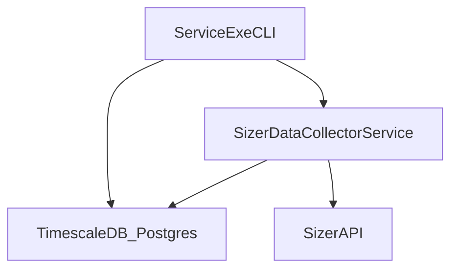

## AI Agent Guide for SizerDataCollector

### Purpose and scope

This guide is for **AI assistants and advanced developers** working on the OPTI-FRESH Sizer Data Collector in Cursor.  
It explains:

- Where the **sources of truth** live (C#, SQL, config).
- How the **CLI**, **Windows service**, and **database** interact.
- How to **safely extend** the system without reintroducing fragile, numbered migrations.

Use this file to decide **where** to make a change and **which commands** to run, before editing any code.

---

### High-level architecture

- **Executable / CLI**: `SizerDataCollector.Service.exe`
  - Hosts the Windows service `SizerDataCollectorService`.
  - Also exposes CLI subcommands for `service`, `db`, `machine`, and configuration.
- **Service process**: `SizerDataCollectorService`
  - Periodically polls the Sizer API, writes raw metrics to TimescaleDB, and drives the OEE pipeline.
  - Uses robust retry/backoff for Sizer API connectivity; it does **not** fail/idle on startup if the API is unreachable.
- **Database**: TimescaleDB/Postgres (e.g. `sizer_metrics_staging`)
  - Contains:
    - Base tables (`public.machines`, `public.batches`, `public.metrics`, etc.).
    - OEE tables (`oee.machine_thresholds`, `oee.band_definitions`, `oee.quality_params`, `oee.perf_params`, etc.).
    - Continuous aggregates (CAGGs) and views used by reporting and dashboards.

Mermaid overview:

---

### Key C# entry points

- **CLI / service host**
  - `SizerDataCollector.Service/Program.cs`
    - Parses top-level commands: `service`, `db`, `machine`, `configure`, `set-*`, `console`, etc.
    - Contains implementations for service install/uninstall/start/stop/restart/status.
- **Database CLI commands**
  - `SizerDataCollector.Service/Commands/DbCommands.cs`
    - `db status`, `db init`, `db apply-functions`, `db apply-caggs`, `db apply-views`, `db apply-all`,
      `db list-functions`, `db list-views`, `db list-caggs`.
- **Machine / OEE configuration CLI**
  - `SizerDataCollector.Service/Commands/MachineCommands.cs`
    - `machine list`, `register`, `status`, `set-thresholds`, `set-settings`, `grade-map`, `commission`,
      `show-quality-params`, `set-quality-params`, `show-perf-params`, `set-perf-params`,
      `show-bands`, `set-band`, `remove-band`.
- **Database helpers**
  - `SizerDataCollector.Core/Db/SqlDefinitionRunner.cs`
    - Resolves SQL definition files from either:
      - `<SharedDataDirectory>\sql\definitions\*`, or
      - `<exe>\sql\definitions\*` (built-in defaults),
    - Executes them over Npgsql; returns an `ApplyResult`.
  - `SizerDataCollector.Core/Db/OeeParamsRepository.cs`
    - Manages:
      - `oee.quality_params`
      - `oee.perf_params`
      - `oee.band_definitions`
    - Used by `MachineCommands` for OEE parameter and band configuration.

When deciding **where to add logic**, prefer:

- New CLI behavior ⇒ extend `Program.cs`, `DbCommands.cs`, or `MachineCommands.cs`.
- New DB-level behavior ⇒ extend the relevant SQL definition file (see below) and use existing CLI commands to apply changes.

---

### Canonical SQL definition files (single source of truth)

All schema-level database changes should be made in **four authoritative files** under the service project:

- `SizerDataCollector.Service/sql/definitions/schema.sql`
  - Schemas, tables, sequences, indexes, constraints, hypertables.
  - Designed to be **idempotent** using `IF NOT EXISTS` and compatible with existing databases.
  - Run via `db init` (which calls `ApplyFile("schema.sql")` followed by the other definitions).

- `SizerDataCollector.Service/sql/definitions/functions.sql`
  - All PostgreSQL **functions**, including:
    - Core OEE helpers (`oee.availability_ratio`, `oee.calc_perf_ratio`, `oee.calc_quality_ratio_qv1`, etc.).
    - Serial-aware overloads that read `oee.perf_params` and `oee.quality_params`.
    - Production-only helpers such as `oee.get_lane_count`, `oee.grade_qty`, `oee.ingest_lane_grade_events`, `oee.refresh_lane_grade_minute`.
  - All definitions use `CREATE OR REPLACE FUNCTION` and are safe to reapply.

- `SizerDataCollector.Service/sql/definitions/continuous_aggregates.sql`
  - All **TimescaleDB continuous aggregate** views and refresh policies:
    - Availability/throughput/grade CAGGs.
    - Refresh policies and any custom jobs.
  - CAGGs are created inside `DO $$` blocks with `IF NOT EXISTS` checks against `timescaledb_information.continuous_aggregates`.
  - Refresh policies use `if_not_exists => true` to avoid duplication.

- `SizerDataCollector.Service/sql/definitions/views.sql`
  - All user-facing **views**, including the higher-level OEE rollups and reporting views that match production.
  - Uses `CREATE OR REPLACE VIEW` and is safe to reapply.

**Rules for agents:**

- Do **not** reintroduce numbered migrations under `db\Migrations\Vxxx_*`.
- To change the schema, **edit these four files** and run the appropriate `db` CLI commands.
- Keep the four files **consistent** with each other (e.g. if a function relies on a new table, ensure the table exists in `schema.sql`).
- Avoid editing TimescaleDB internal objects (schemas beginning with `_timescaledb_internal`).

---

### CLI command reference (for automation)

All commands are executed against `SizerDataCollector.Service.exe` from the service output folder.

#### Configuration and diagnostics

- Show current runtime config:
  - `SizerDataCollector.Service.exe show-config`
- Interactive configuration:
  - `SizerDataCollector.Service.exe configure`
- Set Sizer API endpoint and timeouts:
  - `SizerDataCollector.Service.exe set-sizer --host <host> --port <port> [--open-timeout <sec>] [--send-timeout <sec>] [--receive-timeout <sec>]`
- Set DB connection string:
  - `SizerDataCollector.Service.exe set-db --connection "Host=...;Port=5432;Username=...;Password=...;Database=sizer_metrics_staging;"`
- Enable/disable ingestion via config:
  - `SizerDataCollector.Service.exe set-ingestion --enabled true|false`
- Configure shared data directory (for overriding built-in SQL):
  - `SizerDataCollector.Service.exe set-shared-dir --path "C:\ProgramData\Opti-Fresh\SizerCollector"`
- Probe Sizer API + Timescale connectivity:
  - `SizerDataCollector.Service.exe test-connections`

#### Service lifecycle

- Install service (Admin):
  - `SizerDataCollector.Service.exe service install`
- Uninstall service (Admin):
  - `SizerDataCollector.Service.exe service uninstall`
- Start/stop/restart (Admin):
  - `SizerDataCollector.Service.exe service start [--timeout <seconds>]`
  - `SizerDataCollector.Service.exe service stop  [--timeout <seconds>]`
  - `SizerDataCollector.Service.exe service restart [--timeout <seconds>]`
- Check service status:
  - `SizerDataCollector.Service.exe service status`

#### Database management

- Health/status:
  - `SizerDataCollector.Service.exe db status`
- One-shot, from-scratch or incremental setup:
  - `SizerDataCollector.Service.exe db init`
    - Applies `schema.sql` then all other definition files.
- Targeted re-application:
  - `SizerDataCollector.Service.exe db apply-functions`
  - `SizerDataCollector.Service.exe db apply-caggs`
  - `SizerDataCollector.Service.exe db apply-views`
  - `SizerDataCollector.Service.exe db apply-all`
- Introspection (read-only):
  - `SizerDataCollector.Service.exe db list-functions`
  - `SizerDataCollector.Service.exe db list-views`
  - `SizerDataCollector.Service.exe db list-caggs`

#### Machine / OEE configuration

- Discovery and basic settings:
  - `SizerDataCollector.Service.exe machine list`
  - `SizerDataCollector.Service.exe machine register --serial <sn> --name <name>`
  - `SizerDataCollector.Service.exe machine status --serial <sn>`
  - `SizerDataCollector.Service.exe machine set-thresholds --serial <sn> --min-rpm <val> --min-total-fpm <val>`
  - `SizerDataCollector.Service.exe machine set-settings --serial <sn> --target-speed <val> --lane-count <val> --target-pct <val> --recycle-outlet <val>`

- Grade overrides:
  - List overrides:
    - `SizerDataCollector.Service.exe machine grade-map --serial <sn>`
  - Set/override grade:
    - `SizerDataCollector.Service.exe machine grade-map --serial <sn> --set --grade <key> --category <0-3>`

- Commissioning (non-gating check):
  - `SizerDataCollector.Service.exe machine commission --serial <sn>`
    - Uses `CommissioningService` to summarize readiness: DB bootstrapped, Sizer connectivity, discovery, thresholds, grade mapping.

- Quality parameters:
  - Show:
    - `SizerDataCollector.Service.exe machine show-quality-params --serial <sn>`
  - Upsert (any subset of fields; others default or retain existing values):
    - `SizerDataCollector.Service.exe machine set-quality-params --serial <sn> [--tgt-good <v>] [--tgt-peddler <v>] [--tgt-bad <v>] [--tgt-recycle <v>] [--w-good <v>] [--w-peddler <v>] [--w-bad <v>] [--w-recycle <v>] [--sig-k <v>]`

- Performance parameters:
  - Show:
    - `SizerDataCollector.Service.exe machine show-perf-params --serial <sn>`
  - Upsert:
    - `SizerDataCollector.Service.exe machine set-perf-params --serial <sn> [--min-effective <v>] [--low-ratio <v>] [--cap-asymptote <v>]`

- OEE bands:
  - Show bands:
    - `SizerDataCollector.Service.exe machine show-bands --serial <sn>`
  - Upsert a band:
    - `SizerDataCollector.Service.exe machine set-band --serial <sn> --band <name> --lower <val> --upper <val>`
  - Deactivate a band:
    - `SizerDataCollector.Service.exe machine remove-band --serial <sn> --band <name>`

---

### Configuration and environment rules

- **`SizerDataCollector.Service/app.config`**
  - Treat as the primary place for service-level configuration such as:
    - `TimescaleDb` connection string.
    - `LogDirectory`.
  - Do **not** bake secrets or environment-specific paths directly into code; prefer config.

- **`collector_config.json` (runtime settings)**
  - Managed via `CollectorSettingsProvider` (in Core).
  - The CLI (`set-sizer`, `set-db`, `set-ingestion`, `set-shared-dir`, `configure`) should be the **only** way agents adjust these values.
  - Do not hand-edit this file unless absolutely necessary; use CLI commands instead.

- **Shared data directory**
  - When `SharedDataDirectory` is set, `SqlDefinitionRunner` first checks:
    - `<SharedDataDirectory>\sql\definitions\schema.sql`
    - `<SharedDataDirectory>\sql\definitions\functions.sql`
    - `<SharedDataDirectory>\sql\definitions\continuous_aggregates.sql`
    - `<SharedDataDirectory>\sql\definitions\views.sql`
  - If a file exists there, it **overrides** the embedded copy next to the executable.
  - This is the preferred way to deploy updated SQL to production without rebuilding.

- **Environment variable overrides**
  - `FORCE_ENABLE_INGESTION=1`:
    - Forces ingestion on, even if configuration would disable it.
    - Use sparingly; prefer `set-ingestion --enabled true` when possible.

---

### Safe-change checklist for agents

Before making any change:

1. **Identify the correct layer**
   - CLI / workflow change? ⇒ `Program.cs`, `DbCommands.cs`, `MachineCommands.cs`.
   - DB schema / functions / views / CAGGs change? ⇒ one of the four SQL definition files.
   - OEE per-machine parameter behavior? ⇒ `OeeParamsRepository.cs` and corresponding SQL tables.

2. **Edit the canonical file**
   - Tables/indexes ⇒ `schema.sql`.
   - Functions ⇒ `functions.sql`.
   - Continuous aggregates / policies / jobs ⇒ `continuous_aggregates.sql`.
   - Views ⇒ `views.sql`.

3. **Keep definitions idempotent**
   - Use `CREATE OR REPLACE` for functions and views.
   - Use `IF NOT EXISTS` patterns for tables, sequences, CAGGs, and policies.
   - Avoid dropping or renaming columns in a way that would break existing data without explicit user instruction.

4. **Test in a non-production database**
   - Apply changes to a staging database using:
     - `db init` (for broad changes), or
     - `db apply-functions` / `db apply-caggs` / `db apply-views` (for narrower changes).
   - Confirm `db status` reports a healthy system.

5. **Update documentation when surfaces change**
   - If you add or change CLI commands or options, update:
     - `SizerDataCollector.Service/Program.cs` `ShowUsage()` output.
     - `README.md` CLI usage summary.
     - This `AI_AGENT_GUIDE.md` if the change impacts how agents should operate.

By following this guide, AI assistants can safely modify the system, apply database updates, and reason about configuration without reintroducing legacy migration complexity.

