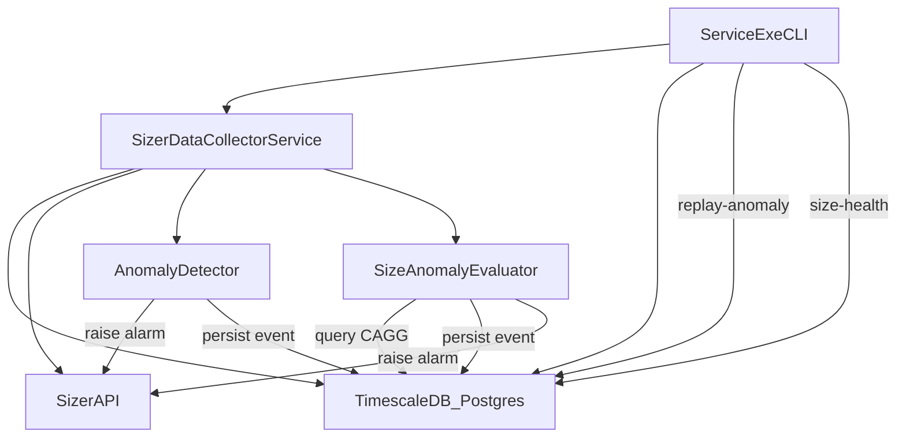
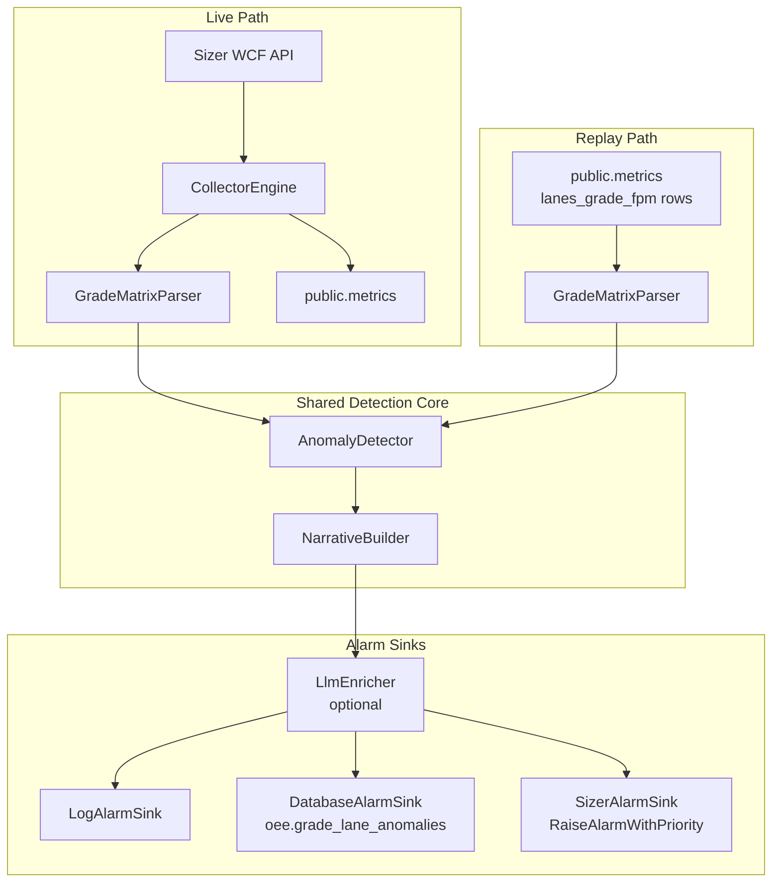
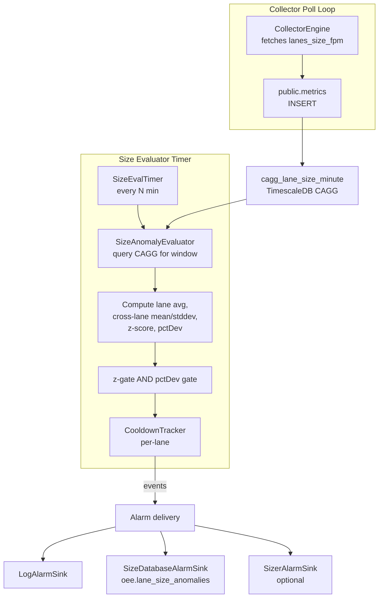

## AI Agent Guide for SizerDataCollector

### Purpose and scope

This guide is for **AI assistants and advanced developers** working on the OPTI-FRESH Sizer Data Collector in Cursor.  
It explains:

- Where the **sources of truth** live (C#, SQL, config).
- How the **CLI**, **Windows service**, and **database** interact.
- How to **safely extend** the system without reintroducing fragile, numbered migrations.

Use this file to decide **where** to make a change and **which commands** to run, before editing any code.

---

### High-level architecture

- **Executable / CLI**: `SizerDataCollector.Service.exe`
  - Hosts the Windows service `SizerDataCollectorService`.
  - Also exposes CLI subcommands for `service`, `db`, `machine`, and configuration.
- **Service process**: `SizerDataCollectorService`
  - Periodically polls the Sizer API, writes raw metrics to TimescaleDB, and drives the OEE pipeline.
  - Uses robust retry/backoff for Sizer API connectivity; it does **not** fail/idle on startup if the API is unreachable.
- **Database**: TimescaleDB/Postgres (e.g. `sizer_metrics_staging`)
  - Contains:
    - Base tables (`public.machines`, `public.batches`, `public.metrics`, etc.).
    - OEE tables (`oee.machine_thresholds`, `oee.band_definitions`, `oee.quality_params`, `oee.perf_params`, etc.).
    - Anomaly events tables (`oee.grade_lane_anomalies`, `oee.lane_size_anomalies`) -- persisted by alarm sinks.
    - Continuous aggregates (CAGGs) and views used by reporting and dashboards.

Mermaid overview:


```mermaid
flowchart TD
  cli[ServiceExeCLI] --> serviceProc[SizerDataCollectorService]
  cli --> db[TimescaleDB_Postgres]
  serviceProc --> db
  serviceProc --> sizerApi[SizerAPI]
  serviceProc --> anomaly[AnomalyDetector]
  anomaly -->|raise alarm| sizerApi
  anomaly -->|persist event| db
  serviceProc --> sizeEval[SizeAnomalyEvaluator]
  sizeEval -->|query CAGG| db
  sizeEval -->|persist event| db
  sizeEval -->|raise alarm| sizerApi
  cli -->|replay-anomaly| db
  cli -->|size-health| db
```

---

### Key C# entry points

- **CLI / service host**
  - `SizerDataCollector.Service/Program.cs`
    - Parses top-level commands: `service`, `db`, `machine`, `configure`, `set-*`, `console`, etc.
    - Contains implementations for service install/uninstall/start/stop/restart/status.
- **Database CLI commands**
  - `SizerDataCollector.Service/Commands/DbCommands.cs`
    - `db status`, `db init`, `db apply-functions`, `db apply-caggs`, `db apply-views`, `db apply-all`,
      `db list-functions`, `db list-views`, `db list-caggs` (optional `--include-legacy` on the two list commands).
- **Machine / OEE configuration CLI**
  - `SizerDataCollector.Service/Commands/MachineCommands.cs`
    - `machine list`, `register`, `status`, `set-thresholds`, `set-settings`, `grade-map`, `commission`,
      `show-quality-params`, `set-quality-params`, `show-perf-params`, `set-perf-params`,
      `show-bands`, `set-band`, `remove-band`.
- **Shift scheduling CLI**
  - `SizerDataCollector.Service/Commands/ShiftCommands.cs`
    - `shift list`, `shift add`, `shift update`, `shift remove`, `shift show`.
- **Database helpers**
  - `SizerDataCollector.Core/Db/SqlDefinitionRunner.cs`
    - Resolves SQL definition files from either:
      - `<SharedDataDirectory>\sql\definitions\*`, or
      - `<exe>\sql\definitions\*` (built-in defaults),
    - Executes them over Npgsql; returns an `ApplyResult`.
  - `SizerDataCollector.Core/Db/OeeParamsRepository.cs`
    - Manages:
      - `oee.quality_params`
      - `oee.perf_params`
      - `oee.band_definitions`
    - Used by `MachineCommands` for OEE parameter and band configuration.

- **Anomaly detection**
  - `SizerDataCollector.Core/AnomalyDetection/`
    - Core files covering: grade detector, size evaluator, lot-transition throughput detector, configs, event models, alarm sinks, JSON parsing, replay, narrative generation.
    - See the [Anomaly detection subsystem](#anomaly-detection-subsystem), [Size anomaly detection subsystem](#size-anomaly-detection-subsystem), and [Lot transition throughput subsystem](#lot-transition-throughput-subsystem) sections for the full file lists.
  - Grade detector: wired into `CollectorEngine.RunSinglePollAsync` (inline, zero extra threads).
  - Size evaluator: runs on its own `Task.Delay`-based timer in `SizerCollectorService.RunSupervisedLoopAsync`.
  - Lot transition evaluator: DB-driven timer in `SizerCollectorService.RunSupervisedLoopAsync`, using `machine_total_fpm` plus batch metadata.
  - CLI commands: `set-anomaly`, `set-sizer-alarm`, `replay-anomaly`, `set-size-anomaly`, `size-health`, `set-lot-transition`, `lot-transition scan`, `lot-transition list`, `lot-transition export`, `set-machine-events`, `machine-event scan/list/export`, `downtime list/export`, `slowdown list/export`, `anomaly offenders`, `anomaly impact`, `anomaly impact-summary`, `anomaly tuning-compare`, and `shift list/add/update/remove/show` in `Program.cs` / command helpers.

When deciding **where to add logic**, prefer:

- New CLI behavior ⇒ extend `Program.cs`, `DbCommands.cs`, or `MachineCommands.cs`.
- New DB-level behavior ⇒ extend the relevant SQL definition file (see below) and use existing CLI commands to apply changes.
- Anomaly detection logic ⇒ `SizerDataCollector.Core/AnomalyDetection/` (see below).

---

### Anomaly detection subsystem

The solution includes a **peer-relative lane composition skew detector** for lane-by-grade throughput data (current `ModelVersion`: `composition-mad-v3`). It compares each lane's rolling grade-share mix against peer lanes using a leave-one-out peer **median** plus a **MAD-derived robust spread**, so obviously skewed lanes can be detected without hard-coding the detector to any specific grade.

#### `lanes_grade_fpm` payload format (real shape)

The raw metric written to `public.metrics` has:

- `metric = 'lanes_grade_fpm'`
- `value_json` = **a JSON array with one entry per lane**. The **array index is the lane number** (0-based). So `value_json[0]` is lane 1, `value_json[31]` is lane 32, etc. There is **no** `lane_no` or numeric key prefix -- the lane is strictly implicit from array position.
- Each entry is an object whose keys look like `"<descriptor>_<grade>"` (e.g. `"2026 Delta Map_Peddler"`, `"2026 Delta Map_D/S"`). Values are fruit-per-minute numbers. **Only the suffix after the final underscore is the grade**; everything before it is a descriptor label (often containing the year, so naive prefix parsing will mis-identify lanes).
- Empty outlets appear as empty objects (`{}`) and are treated as a zero row for that lane. Missing grade keys in a given minute are treated as zero for that grade.

Example:
```json
[
  { "2026 Delta Map_D1": 15, "2026 Delta Map_Peddler": 20 },
  { "2026 Delta Map_D1": 18, "2026 Delta Map_Peddler": 12 },
  {},
  ...,
  { "2026 Delta Map_Peddler": 696, "2026 Delta Map_D/S": 66, "2026 Delta Map_Cull": 2 }
]
```

`GradeMatrixParser` is the single source of truth for interpreting this shape (live and replay). `GradeMatrixParser.GetRawKeys(valueJson)` returns the distinct raw keys seen in the payload -- useful from diagnostic tools without parsing the full matrix.

#### How detection works

1. Every collector poll cycle, `CollectorEngine` fetches `lanes_grade_fpm` from the Sizer WCF API and writes the raw JSON to `public.metrics`.
2. When `EnableAnomalyDetection` is `true`, the engine parses that same in-memory JSON via `GradeMatrixParser` into a `GradeMatrix` (lanes x grades double array) using array-index-as-lane and final-underscore-as-grade.
3. `AnomalyDetector.Update(matrix, ...)` does the following:
   - **Canonical dimensions**: the detector tracks a monotonically-growing set of lane indices and grade keys. A snapshot that introduces a new grade or higher lane index *extends* the internal matrices with zero-padded columns/rows; a snapshot that omits a previously-seen grade contributes zero for that slot. **The rolling window is never wiped on grade-set fluctuation** -- this is critical on live machines where the emitted grade set changes minute-to-minute.
   - Adds the snapshot to a rolling window (`AnomalyWindowMinutes`, default 60 samples).
   - Converts each active lane to **grade-share percentages** over the aggregated window.
   - For each lane+grade, builds a **peer set that excludes the lane under test** and whose peer lanes pass `AnomalyMinPeerLaneFpm`.
   - Calculates the **peer median share** and a **MAD-based robust spread** for that grade.
   - Computes a robust score: `score = (laneSharePct - peerMedianPct) / max(MAD * 1.4826, floor)`.
   - Gates evaluation on `AnomalyMinLaneFpm`, `AnomalyMinPeerLaneFpm`, and `AnomalyMinActivePeerLanes`.
   - Emits a lane-level composition-skew event when any grade's share delta AND robust score cross threshold (with a large-delta fallback in case peer variance is unusually broad), sustained for `AnomalyMinConsecutiveWindows`.
   - Applies per-(lane, grade) cooldown (`AlarmCooldownSeconds`).
   - Generates an **operator-friendly** narrative via `NarrativeBuilder` (e.g. "Lane 32: producing mostly Peddler (63% vs 18% typical)"). Technical numbers (score, raw deltas, peer medians) are preserved in `AnomalyEvent.ExplanationJson` for programmatic consumers.
4. Detected events flow through the `IAlarmSink` chain:
   - `LogAlarmSink` -- collector log.
   - `DatabaseAlarmSink` -- `oee.grade_lane_anomalies`.
   - `SizerAlarmSink` -- `RaiseAlarmWithPriority` on the Sizer WCF API (operator screen).
   - `LlmEnricher` (optional) -- decorates the event with an LLM-generated explanation before forwarding.

The detector runs **inline** in the collector poll loop -- zero extra threads, API calls, or DB reads in live operation. If the collector is down, the detector is idle.

#### Batch-change reset

When `CollectorEngine` detects that `batch_record_id` has changed between poll cycles, it calls `AnomalyDetector.Reset()`, which clears the rolling window, cooldowns, per-lane consecutive-signal counters, **and** the canonical grade-key/lane tables. This prevents cross-batch statistical contamination.

#### Diagnostic replay (`replay-anomaly --diag`)

`replay-anomaly` supports a diagnostic mode for inspecting detector state on live data without changing thresholds:

- `--diag` -- on the first snapshot, dumps the raw distinct grade keys seen in `lanes_grade_fpm` (via `GradeMatrixParser.GetRawKeys`) and then, after the final snapshot, dumps detector state (canonical lane count, canonical grade list, rolling window sample count, per-lane average FPM, eligible peer counts, consecutive-signal counters, and (lane, grade) share vs peer-median tables).
- `--diag-lane <N>` -- focuses the per-lane dump on a specific 1-based lane.

Use this when a skew that's obvious in the data isn't being surfaced: the diagnostic output tells you whether the problem is parsing (wrong lane count / empty grade keys), sample volume (window never filled), guardrails (lane or peer FPM below floor), or scoring (delta/score not crossing thresholds).

#### Key files

| File | Purpose |
|------|---------|
| `SizerDataCollector.Core/AnomalyDetection/AnomalyDetector.cs` | Core peer-relative composition engine (rolling window, median/MAD scoring, guardrails, alarm evaluation) |
| `SizerDataCollector.Core/AnomalyDetection/AnomalyDetectorConfig.cs` | Settings POCO built from `CollectorConfig` |
| `SizerDataCollector.Core/AnomalyDetection/AnomalyEvent.cs` | Event model matching `oee.grade_lane_anomalies` schema |
| `SizerDataCollector.Core/AnomalyDetection/GradeMatrix.cs` | Immutable lanes x grades double array with grade key labels |
| `SizerDataCollector.Core/AnomalyDetection/GradeMatrixParser.cs` | Parses raw `lanes_grade_fpm` JSON into `GradeMatrix` (shared by live + replay) |
| `SizerDataCollector.Core/AnomalyDetection/NarrativeBuilder.cs` | Alarm text generation for lane composition skew and peer-share context |
| `SizerDataCollector.Core/AnomalyDetection/PriorityClassifier.cs` | Band classification (None/Low/Medium/High) and WCF `AlarmPriority` mapping |
| `SizerDataCollector.Core/AnomalyDetection/CooldownTracker.cs` | Per-(lane, gradeKey) cooldown tracker |
| `SizerDataCollector.Core/AnomalyDetection/IAlarmSink.cs` | Alarm delivery interface |
| `SizerDataCollector.Core/AnomalyDetection/SizerAlarmSink.cs` | Delivers alarms to Sizer via WCF `RaiseAlarmWithPriority` |
| `SizerDataCollector.Core/AnomalyDetection/DatabaseAlarmSink.cs` | Persists events to `oee.grade_lane_anomalies` |
| `SizerDataCollector.Core/AnomalyDetection/LogAlarmSink.cs` | Structured logging via existing `Logger` |
| `SizerDataCollector.Core/AnomalyDetection/CompositeAlarmSink.cs` | Fans out delivery to all enabled sinks |
| `SizerDataCollector.Core/AnomalyDetection/LlmEnricher.cs` | Optional LLM decorator for `IAlarmSink` |
| `SizerDataCollector.Core/AnomalyDetection/ReplayDataSource.cs` | Reads raw JSON from `public.metrics` for offline replay |

#### Configuration properties (in `collector_config.json`)

| Property | Default | Description |
|----------|---------|-------------|
| `EnableAnomalyDetection` | `false` | Master toggle for the anomaly detector |
| `AnomalyWindowMinutes` | `60` | Rolling window size (number of samples) |
| `AnomalyZGate` | `2.0` | Minimum robust score required to trigger an alarm |
| `BandLowMin` | `5.0` | Minimum absolute share delta (percentage points vs peer median) for any alarm |
| `BandLowMax` | `10.0` | Upper bound for Low severity (below this = Low) |
| `BandMediumMax` | `20.0` | Upper bound for Medium severity (above this = High) |
| `AlarmCooldownSeconds` | `300` | Seconds before the same (lane, grade) pair can alarm again |
| `RecycleGradeKey` | `"RCY"` | Grade key receiving special narrative treatment |
| `AnomalyMinLaneFpm` | `150.0` | Minimum average lane throughput required before a lane is evaluated |
| `AnomalyMinPeerLaneFpm` | `150.0` | Minimum average throughput required for a peer lane to be included in the baseline |
| `AnomalyMinActivePeerLanes` | `4` | Minimum number of eligible peer lanes required before scoring |
| `AnomalyMinConsecutiveWindows` | `2` | Number of consecutive qualifying windows required before emitting an event |
| `EnableSizerAlarm` | `true` | Send anomaly alarms to Sizer operator screen (can be toggled independently of detection) |
| `EnableLlmEnrichment` | `false` | Enable LLM-generated operator explanations |
| `LlmEndpoint` | `""` | URL of the LLM API for enrichment |

#### Data flow diagram


```mermaid
flowchart TD
    subgraph livePath [Live Path]
        SIZER["Sizer WCF API"]
        ENGINE["CollectorEngine"]
        PARSER["GradeMatrixParser"]
        DB_WRITE["public.metrics"]
    end

    subgraph replayPath [Replay Path]
        DB_READ["public.metrics\nlanes_grade_fpm rows"]
        REPLAY_PARSER["GradeMatrixParser"]
    end

    subgraph detector [Shared Detection Core]
        DET["AnomalyDetector"]
        NARR["NarrativeBuilder"]
    end

    subgraph sinks [Alarm Sinks]
        LOG_SINK["LogAlarmSink"]
        DB_SINK["DatabaseAlarmSink\noee.grade_lane_anomalies"]
        SIZER_SINK["SizerAlarmSink\nRaiseAlarmWithPriority"]
        LLM_SINK["LlmEnricher\noptional"]
    end

    SIZER --> ENGINE
    ENGINE --> PARSER
    ENGINE --> DB_WRITE
    PARSER --> DET

    DB_READ --> REPLAY_PARSER
    REPLAY_PARSER --> DET

    DET --> NARR
    NARR --> LLM_SINK
    LLM_SINK --> LOG_SINK
    LLM_SINK --> DB_SINK
    LLM_SINK --> SIZER_SINK
```

### Size anomaly detection subsystem

The solution includes a **periodic lane-size anomaly evaluator** that detects when a lane's average fruit size deviates significantly from the cross-lane mean. Unlike the inline grade detector, this evaluator is DB-driven and runs on its own timer.

#### How it works

1. The collector already writes `lanes_size_fpm` JSON to `public.metrics` every poll cycle.
2. TimescaleDB materializes `cagg_lane_size_minute` -- per `(minute, serial_no, lane)` weighted-average fruit size (never mixed across sizers).
3. When `EnableSizeAnomalyDetection` is `true`, a background timer fires every `SizeEvalIntervalMinutes` (default 30) and runs the `SizeAnomalyEvaluator`:
   - Queries the CAGG for the last `SizeWindowHours` (default 24h), computing each lane's fruit-count-weighted average size.
   - Computes the cross-lane mean and population stddev.
   - For each lane: `z = (lane_avg - machine_avg) / stddev` and `pctDev = 100 * (lane_avg - machine_avg) / machine_avg`.
   - An alarm fires when **both** `|z| >= SizeZGate` AND `|pctDev| >= SizePctDevMin`.
   - Severity: Low (< 5% deviation), Medium (5-10%), High (>= 10%).
   - Per-lane cooldown of `SizeCooldownMinutes` (default 240 = 4 hours) prevents alarm flooding.
4. Alarms are delivered to:
   - `LogAlarmSink` -- always.
   - `SizeDatabaseAlarmSink` -- INSERTs into `oee.lane_size_anomalies`.
   - `SizerAlarmSink` -- only when `EnableSizerSizeAlarm` is `true` (off by default).

#### Narrative format

```
Lane 3: sorting 4.6% larger fruit than average (27.2mm vs 26.0mm avg, +1.2mm, +4.6%, z=+3.0, last 24h)
Lane 7: sorting 3.1% smaller fruit than average (25.2mm vs 26.0mm avg, -0.8mm, -3.1%, z=-2.1, last 24h)
```

#### Key differences from grade anomaly detection

| Aspect | Grade detector | Size detector |
|--------|---------------|---------------|
| Trigger | Per-minute, inline in poll loop | Periodic timer, DB-driven |
| Data source | In-memory raw JSON from WCF API | `cagg_lane_size_minute` CAGG |
| Window | 60 samples (rolling) | 24 hours (configurable) |
| Metric | Grade proportions per lane vs cross-lane mean | Weighted-average fruit size per lane vs cross-lane mean |
| Default cooldown | 5 minutes | 4 hours |
| Sizer alarm | On by default | Off by default |

#### Key files

| File | Purpose |
|------|---------|
| `SizerDataCollector.Core/AnomalyDetection/SizeAnomalyEvaluator.cs` | Core evaluator: queries CAGG, computes cross-lane stats, gates alarms, generates narrative |
| `SizerDataCollector.Core/AnomalyDetection/SizeAnomalyConfig.cs` | Configuration POCO extracted from `CollectorConfig` |
| `SizerDataCollector.Core/AnomalyDetection/SizeAnomalyEvent.cs` | Event model matching `oee.lane_size_anomalies` schema |
| `SizerDataCollector.Core/AnomalyDetection/SizeDatabaseAlarmSink.cs` | Persists size anomaly events to `oee.lane_size_anomalies` |

#### Size anomaly configuration properties (in `collector_config.json`)

| Property | Default | Description |
|----------|---------|-------------|
| `EnableSizeAnomalyDetection` | `false` | Master toggle for the size anomaly evaluator |
| `EnableSizerSizeAlarm` | `false` | Send size alarms to Sizer operator screen |
| `SizeEvalIntervalMinutes` | `30` | How often the evaluator runs |
| `SizeWindowHours` | `24` | Lookback window in hours |
| `SizeZGate` | `2.0` | Minimum \|z-score\| to trigger an alarm |
| `SizePctDevMin` | `3.0` | Minimum \|percent deviation\| to trigger an alarm |
| `SizeCooldownMinutes` | `240` | Per-lane cooldown (4 hours) |

#### Size anomaly data flow


```mermaid
flowchart TD
    subgraph collector [Collector Poll Loop]
        POLL["CollectorEngine\nfetches lanes_size_fpm"] --> DB_WRITE["public.metrics\nINSERT"]
    end
    DB_WRITE --> CAGG["cagg_lane_size_minute\nTimescaleDB CAGG"]
    subgraph sizeEval [Size Evaluator Timer]
        TIMER["SizeEvalTimer\nevery N min"] --> QUERY["SizeAnomalyEvaluator\nquery CAGG for window"]
        QUERY --> STATS["Compute lane avg,\ncross-lane mean/stddev,\nz-score, pctDev"]
        STATS --> GATE["z-gate AND pctDev gate"]
        GATE --> COOLDOWN["CooldownTracker\nper-lane"]
    end
    CAGG --> QUERY
    COOLDOWN -->|events| SINK_CHAIN["Alarm delivery"]
    SINK_CHAIN --> LOG_SINK["LogAlarmSink"]
    SINK_CHAIN --> DB_SINK["SizeDatabaseAlarmSink\noee.lane_size_anomalies"]
    SINK_CHAIN --> SIZER_SINK["SizerAlarmSink\noptional"]
```

### Lot transition throughput subsystem

The solution includes a **periodic lot-transition throughput detector** that measures disruption around grower lot or batch changes. It uses `machine_total_fpm` as the primary signal, stores one idempotent event per `(serial_no, incoming_batch_record_id)`, and optionally enriches the event with availability context from OEE minute views.

How it works:

1. The analyzer loads `public.metrics` rows where `metric = 'machine_total_fpm'` for one `serial_no` and a requested time range.
2. It detects `batch_record_id` changes and joins labels from `public.batches`.
3. For each transition, it computes outgoing stable FPM, incoming recovered FPM, slowdown start, trough, stable recovery, pre/post peaks, peak-to-peak duration, and estimated fruit opportunity shortfall.
4. It skips transitions that do not have enough stable pre/post context or do not recover within the search window.
5. `LotTransitionDatabaseSink` persists rows to `oee.lot_transition_throughput_events` using `ON CONFLICT DO NOTHING`.

Key files:

- `SizerDataCollector.Core/AnomalyDetection/LotTransitionAnalyzer.cs` -- core detector and FPM integration.
- `SizerDataCollector.Core/AnomalyDetection/LotTransitionConfig.cs` -- runtime configuration extracted from `CollectorConfig`.
- `SizerDataCollector.Core/AnomalyDetection/LotTransitionModels.cs` -- point, batch, event, and report models.
- `SizerDataCollector.Core/AnomalyDetection/LotTransitionDatabaseSink.cs` -- DB persistence.
- `SizerDataCollector.Service/Commands/LotTransitionCommands.cs` -- `scan`, `list`, and `export`.
- `LOT_TRANSITION_WORKFLOW.md` -- reporting workflow for operators and AI agents.

Configuration properties in `collector_config.json`:

- `EnableLotTransitionDetection` (default `false`) -- master toggle for the background loop.
- `LotTransitionEvalIntervalMinutes` (default `30`) -- how often the service loop scans.
- `LotTransitionScanWindowHours` (default `72`) -- sliding scan window used by the service loop.
- `LotTransitionStableWindowMinutes` (default `10`) -- stable context window before/after transitions.
- `LotTransitionPeakSearchMinutes` (default `30`) -- bounded peak-to-peak search window.
- `LotTransitionSlowdownFraction` (default `0.15`) -- material slowdown threshold versus outgoing stable FPM.
- `LotTransitionRecoveryFraction` (default `0.10`) -- recovered threshold versus incoming stable FPM.
- `LotTransitionConsecutiveSamplesForSlowdown` (default `1`) and `LotTransitionRecoveryConsecutiveSamples` (default `2`) -- consecutive-sample gates.
- `LotTransitionMinPreStableSamples` and `LotTransitionMinPostStableSamples` (default `3`) -- minimum stable-context samples.
- `LotTransitionMinFpmForBaseline` (default `100`) -- low-FPM filter for stable baselines.

Useful CLI commands:

```powershell
SizerDataCollector.Service.exe set-lot-transition --enabled true --interval 30 --scan-hours 72
SizerDataCollector.Service.exe lot-transition scan --serial <sn> --day 2026-04-23
SizerDataCollector.Service.exe lot-transition scan --serial <sn> --hours 72 --no-persist
SizerDataCollector.Service.exe lot-transition list --serial <sn> --month 2026-04
SizerDataCollector.Service.exe lot-transition export --serial <sn> --year 2026
```

#### Database objects

- **`public.cagg_lane_size_minute`** -- TimescaleDB continuous aggregate. Defined in `continuous_aggregates.sql`. One row per `(minute_ts, serial_no, lane_idx)`: weighted-average fruit size from `lanes_size_fpm` for that sizer only. Filters out null JSON array elements. `SizeAnomalyEvaluator` always filters `WHERE serial_no = @serial_no`. If you deployed an older CAGG without `serial_no`, drop it and re-apply (see comment in `continuous_aggregates.sql`), then refresh the aggregate.
- **`public.lane_size_anomaly`**, **`public.lane_size_health_24h`**, **`public.lane_size_health_season`** -- Defined in `views.sql`. All partition cross-lane stats by `serial_no`. Dashboard SQL should filter `WHERE serial_no = '<sn>'` (replacing any hard-coded serial).
- **`oee.lane_size_anomalies`** -- Event table. Defined in `schema.sql`. Stores `event_ts`, `serial_no`, `lane_no`, `window_hours`, `lane_avg_size`, `machine_avg_size`, `pct_deviation`, `z_score`, `severity`, `model_version`, `delivered_to`.
- **`oee.grade_lane_anomalies`** -- Event table. Defined in `schema.sql`. Stores `event_ts`, `serial_no`, `batch_record_id`, `lane_no`, `grade_key`, `qty`, `pct`, `anomaly_score`, `severity`, **`explanation`** (jsonb detector payload — lane vs peer grades, deltas, robust scores, window/FPM/peers metadata), `model_version`, `delivered_to`. **Alarm title/details** (`NarrativeBuilder` output on `AnomalyEvent`) go to logs and Sizer sinks only — they are **not** persisted as separate columns here.
- **`oee.lot_transition_throughput_events`** -- Event table. Defined in `schema.sql`. Stores serial-aware and batch-aware transition timings, FPM baselines, peak-to-peak opportunity loss, availability context, `explanation`, `model_version`, and `delivered_to`.
- **`oee.shifts`** -- Shift-definition table. Defined in `schema.sql`. Stores per-serial local-clock shift boundaries, timezone, day-of-week mask, activation flag, and effective date range.
- **`oee.v_lot_transition_throughput_event_detail`** -- Reporting view for saved lot transition throughput events.
- **`oee.v_shift_window`**, **`oee.v_availability_shift_batch`**, **`oee.v_throughput_shift_batch`**, **`oee.v_quality_shift_batch`**, **`oee.v_oee_shift_batch`**, **`oee.v_oee_shift`** -- Shift-window expansion and shift-level OEE rollup views.
- **`oee.v_grade_anomaly_event_detail`** -- Reporting view over `oee.grade_lane_anomalies`. Includes **`explanation`** jsonb so SQL and dashboards can read the structured detector breakdown without querying the raw table directly.
- **`oee.v_size_anomaly_event_detail`** -- Reporting view over `oee.lane_size_anomalies`. **`explanation`** is **`NULL::jsonb`** (size events keep numeric fields only today).
- **`oee.v_anomaly_event_detail`** -- `UNION ALL` of grade + size detail views. **`explanation`** is set for **`anomaly_type = 'grade'`** and null for **`anomaly_type = 'size'`**. Preferred surface for anomaly rows that combine both types when writing generic SQL / agent reporting.
- **`oee.v_anomaly_offender_scorecard_daily`** -- Daily recurring-offender rollup over persisted anomaly events.
- **`oee.v_anomaly_offender_cluster_daily`** -- Daily offender clustering metrics (active minutes, span, direction, runtime share).
- **`oee.v_grade_anomaly_impact_summary`**, **`oee.v_size_anomaly_impact_summary`**, **`oee.v_anomaly_impact_summary`** -- Reporting views that correlate persisted anomaly events with minute-level throughput, quality, and OEE context.
- **`oee.v_anomaly_impact_family_summary_daily`** -- Daily family-level post-impact rollup with materiality labels.

---

### Canonical SQL definition files (single source of truth)

All schema-level database changes should be made in **four authoritative files** under the service project:

- `SizerDataCollector.Service/sql/definitions/schema.sql`
  - Schemas, tables, sequences, indexes, constraints, hypertables.
  - Designed to be **idempotent** using `IF NOT EXISTS` and compatible with existing databases.
  - Run via `db init` (which calls `ApplyFile("schema.sql")` followed by the other definitions).

- `SizerDataCollector.Service/sql/definitions/functions.sql`
  - All PostgreSQL **functions**, including:
    - Core OEE helpers (`oee.availability_ratio`, `oee.calc_perf_ratio`, `oee.calc_quality_ratio_qv1`, etc.).
    - Serial-aware overloads that read `oee.perf_params` and `oee.quality_params`.
    - Production-only helpers such as `oee.get_lane_count`, `oee.grade_qty`, `oee.ingest_lane_grade_events`, `oee.refresh_lane_grade_minute`.
  - All definitions use `CREATE OR REPLACE FUNCTION` and are safe to reapply.

- `SizerDataCollector.Service/sql/definitions/continuous_aggregates.sql`
  - All **TimescaleDB continuous aggregate** views and refresh policies:
    - Availability/throughput/grade CAGGs.
    - Refresh policies and any custom jobs.
  - CAGGs are created inside `DO $$` blocks with `IF NOT EXISTS` checks against `timescaledb_information.continuous_aggregates`.
  - Refresh policies use `if_not_exists => true` to avoid duplication.
  - **Legacy (intentionally absent):** `public.cagg_lane_grade_minute` is **not** defined here. Older databases may still have it; it reads `lanes_grade_fpm` directly and refresh can fail on bad JSON. The supported path is `oee.lane_grade_minute` (via the `oee.refresh_lane_grade_minute` job) and the `oee.cagg_lane_grade_qty_*` / `oee.cagg_grade_qty_*` CAGGs. **`db list-caggs`** and **`db list-views`** omit that legacy CAGG and `public.v_quality_minute_filled` unless **`--include-legacy`**. Do not add `CALL refresh_continuous_aggregate('public.cagg_lane_grade_minute', …)` to normal runbooks.

- `SizerDataCollector.Service/sql/definitions/views.sql`
  - All user-facing **views**, including the higher-level OEE rollups and reporting views that match production.
  - Uses `CREATE OR REPLACE VIEW` and is safe to reapply.

**Rules for agents:**

- Do **not** reintroduce numbered migrations under `db\Migrations\Vxxx_*`.
- To change the schema, **edit these four files** and run the appropriate `db` CLI commands.
- Keep the four files **consistent** with each other (e.g. if a function relies on a new table, ensure the table exists in `schema.sql`).
- Avoid editing TimescaleDB internal objects (schemas beginning with `_timescaledb_internal`).

---

### CLI command reference (for automation)

All commands are executed against `SizerDataCollector.Service.exe` from the service output folder.

#### Configuration and diagnostics

- Show current runtime config:
  - `SizerDataCollector.Service.exe show-config`
- Interactive configuration:
  - `SizerDataCollector.Service.exe configure`
- Set Sizer API endpoint and timeouts:
  - `SizerDataCollector.Service.exe set-sizer --host <host> --port <port> [--open-timeout <sec>] [--send-timeout <sec>] [--receive-timeout <sec>]`
- Set DB connection string:
  - `SizerDataCollector.Service.exe set-db --connection "Host=...;Port=5432;Username=...;Password=...;Database=sizer_metrics_staging;"`
- Enable/disable ingestion via config:
  - `SizerDataCollector.Service.exe set-ingestion --enabled true|false`
- Configure shared data directory (for overriding built-in SQL):
  - `SizerDataCollector.Service.exe set-shared-dir --path "C:\ProgramData\Opti-Fresh\SizerCollector"`
- Probe Sizer API + Timescale connectivity:
  - `SizerDataCollector.Service.exe test-connections`

#### Service lifecycle

- Install service (Admin):
  - `SizerDataCollector.Service.exe service install`
- Uninstall service (Admin):
  - `SizerDataCollector.Service.exe service uninstall`
- Start/stop/restart (Admin):
  - `SizerDataCollector.Service.exe service start [--timeout <seconds>]`
  - `SizerDataCollector.Service.exe service stop  [--timeout <seconds>]`
  - `SizerDataCollector.Service.exe service restart [--timeout <seconds>]`
- Check service status:
  - `SizerDataCollector.Service.exe service status`

#### Database management

- Health/status:
  - `SizerDataCollector.Service.exe db status`
- One-shot, from-scratch or incremental setup:
  - `SizerDataCollector.Service.exe db init`
    - Applies `schema.sql` then all other definition files.
- Targeted re-application:
  - `SizerDataCollector.Service.exe db apply-functions`
  - `SizerDataCollector.Service.exe db apply-caggs`
  - `SizerDataCollector.Service.exe db apply-views`
  - `SizerDataCollector.Service.exe db apply-all`
- Introspection (read-only):
  - `SizerDataCollector.Service.exe db list-functions`
  - `SizerDataCollector.Service.exe db list-views`  
    Append `--include-legacy` to list retired `public.cagg_lane_grade_minute` and `public.v_quality_minute_filled` when they still exist.
  - `SizerDataCollector.Service.exe db list-caggs`  
    Append `--include-legacy` to list retired `public.cagg_lane_grade_minute` when it still exists.

#### Machine / OEE configuration

- Discovery and basic settings:
  - `SizerDataCollector.Service.exe machine list`
  - `SizerDataCollector.Service.exe machine register --serial <sn> --name <name>`
  - `SizerDataCollector.Service.exe machine status --serial <sn>`
  - `SizerDataCollector.Service.exe machine set-thresholds --serial <sn> --min-rpm <val> --min-total-fpm <val>`
  - `SizerDataCollector.Service.exe machine set-settings --serial <sn> --target-speed <val> --lane-count <val> --target-pct <val> --recycle-outlet <val>`

- Grade overrides:
  - List overrides:
    - `SizerDataCollector.Service.exe machine grade-map --serial <sn>`
  - Set/override grade:
    - `SizerDataCollector.Service.exe machine grade-map --serial <sn> --set --grade <key> --category <0-3>`

- Commissioning (non-gating check):
  - `SizerDataCollector.Service.exe machine commission --serial <sn>`
    - Uses `CommissioningService` to summarize readiness: DB bootstrapped, Sizer connectivity, discovery, thresholds, grade mapping.

- Quality parameters:
  - Show:
    - `SizerDataCollector.Service.exe machine show-quality-params --serial <sn>`
  - Upsert (any subset of fields; others default or retain existing values):
    - `SizerDataCollector.Service.exe machine set-quality-params --serial <sn> [--tgt-good <v>] [--tgt-peddler <v>] [--tgt-bad <v>] [--tgt-recycle <v>] [--w-good <v>] [--w-peddler <v>] [--w-bad <v>] [--w-recycle <v>] [--sig-k <v>]`

- Performance parameters:
  - Show:
    - `SizerDataCollector.Service.exe machine show-perf-params --serial <sn>`
  - Upsert:
    - `SizerDataCollector.Service.exe machine set-perf-params --serial <sn> [--min-effective <v>] [--low-ratio <v>] [--cap-asymptote <v>]`

- OEE bands:
  - Show bands:
    - `SizerDataCollector.Service.exe machine show-bands --serial <sn> [--metric <oee|throughput>]`
  - Upsert a band:
    - `SizerDataCollector.Service.exe machine set-band --serial <sn> [--metric <oee|throughput>] --band <name> --lower <val> --upper <val>`
  - Deactivate a band:
    - `SizerDataCollector.Service.exe machine remove-band --serial <sn> [--metric <oee|throughput>] --band <name>`
  - Tune throughput bands from recent running minutes:
    - `SizerDataCollector.Service.exe machine tune-bands --serial <sn> --metric throughput [--history-days 7] [--apply]`
  - Use `oee.v_throughput_minute_classified` for throughput target-zone timelines and see `ADAPTIVE_THROUGHPUT_BANDS.md` before changing active throughput bands.

#### Grade anomaly detection

- Enable/disable grade anomaly detection:
  - `SizerDataCollector.Service.exe set-anomaly --enabled true|false`
  - Can also configure individual parameters:
    - `--window <minutes>` -- rolling window size.
    - `--z-gate <value>` -- robust score threshold (e.g. `2.0`).
    - `--band-low-min <share-pts>` -- minimum lane-vs-peer share delta to alarm.
    - `--band-low-max <share-pts>` -- Low/Medium boundary.
    - `--band-medium-max <share-pts>` -- Medium/High boundary.
    - `--cooldown <seconds>` -- per-(lane, grade) alarm cooldown.
    - `--recycle-key <name>` -- grade key treated as Recycle.
    - `--min-lane-fpm <value>` -- minimum lane throughput before evaluation.
    - `--min-peer-lane-fpm <value>` -- minimum peer-lane throughput for baseline inclusion.
    - `--min-peer-lanes <count>` -- minimum eligible peer count.
    - `--consecutive-windows <count>` -- qualifying windows required before alerting.
    - `--llm true|false` -- enable LLM enrichment.
    - `--llm-endpoint <url>` -- LLM API endpoint.
- Enable/disable Sizer alarm screen delivery (independent of detection):
  - `SizerDataCollector.Service.exe set-sizer-alarm --enabled true|false`
  - When `false`, anomaly detection still runs and logs/persists to DB, but does not send alarms to the Sizer operator screen.
- Replay grade anomaly detection against historical data:
  - `SizerDataCollector.Service.exe replay-anomaly --serial <sn> --from <datetime> --to <datetime> [--persist]`
    - Reads raw `lanes_grade_fpm` JSON payloads from `public.metrics` for the given serial number and time range.
    - Feeds them through the same `AnomalyDetector` + `GradeMatrixParser` pipeline used in live mode.
    - Outputs detected anomaly events to the console (and to log).
    - With `--persist`, also writes events to the `IAlarmSink` chain (DB + Sizer alarm + LLM if enabled).

#### Size anomaly detection

- Enable/disable size anomaly detection:
  - `SizerDataCollector.Service.exe set-size-anomaly --enabled true|false`
  - Can also configure individual parameters:
    - `--interval <minutes>` -- evaluation interval.
    - `--window <hours>` -- lookback window in hours.
    - `--z-gate <value>` -- z-score threshold (e.g. `2.0`).
    - `--pct-dev-min <value>` -- minimum percent deviation to alarm (e.g. `3.0`).
    - `--cooldown <minutes>` -- per-lane cooldown in minutes.
    - `--sizer-alarm true|false` -- enable/disable Sizer screen delivery for size alarms.
- Query lane size health (doubles as testing/replay tool):
  - `SizerDataCollector.Service.exe size-health --serial <sn> [--hours <h>]`
  - `SizerDataCollector.Service.exe size-health --serial <sn> --from <date> --to <date>`
  - Displays a table showing each lane's average size, deviation from machine average, percent deviation, z-score, and alarm status.
  - Example output:
    ```
    Lane size health for 140578 (1 days, machine avg = 25.1mm)

    Lane | Avg Size | vs Machine |  pctDev  |  z-score | Status
    -----|----------|------------|----------|----------|--------
       1 |   25.1mm |     +0.0mm |    +0.0% |     +1.2 |
       8 |   25.6mm |     +0.5mm |    +3.5% |     +2.8 | ALARM (oversizing)
    ```

#### Lot transition throughput detection

- Enable/disable the background scan loop:
  - `SizerDataCollector.Service.exe set-lot-transition --enabled true|false`
  - Common tuning options: `--interval <minutes>`, `--scan-hours <hours>`, `--stable-window <minutes>`, `--peak-search <minutes>`, `--slowdown-fraction <0-1>`, `--recovery-fraction <0-1>`, and `--min-fpm <value>`.
- Scan historical data and persist reportable transitions:
  - `SizerDataCollector.Service.exe lot-transition scan --serial <sn> [--hours <h>]`
  - `SizerDataCollector.Service.exe lot-transition scan --serial <sn> --day <yyyy-MM-dd>`
  - `SizerDataCollector.Service.exe lot-transition scan --serial <sn> --month <yyyy-MM>`
  - Add `--no-persist` to preview without inserting.
- List or export saved events:
  - `SizerDataCollector.Service.exe lot-transition list --serial <sn> --month <yyyy-MM>`
  - `SizerDataCollector.Service.exe lot-transition export --serial <sn> --year <yyyy>`
- Use this workflow when the report question is about changeover duration, peak-production minutes lost, or fruit throughput opportunity cost around grower lot changes.

#### Shift scheduling and shift windows

- Configure shift definitions:
  - `SizerDataCollector.Service.exe shift list --serial <sn>`
  - `SizerDataCollector.Service.exe shift add --serial <sn> --name <shift> --start <HH:mm> --end <HH:mm> [--tz <IANA zone>] [--dow Mon-Fri|Mon,Wed,Fri|all] [--effective-from <yyyy-MM-dd>] [--effective-to <yyyy-MM-dd>] [--active true|false]`
  - `SizerDataCollector.Service.exe shift update --serial <sn> --name <shift> [--start <HH:mm>] [--end <HH:mm>] [--tz <IANA zone>] [--dow ...] [--effective-from <yyyy-MM-dd>] [--effective-to <yyyy-MM-dd>] [--active true|false]`
  - `SizerDataCollector.Service.exe shift remove --serial <sn> --name <shift>`
- Validate expanded windows for a local day:
  - `SizerDataCollector.Service.exe shift show --serial <sn> --day <yyyy-MM-dd>`
- Use this workflow when report windows must follow local shift boundaries instead of UTC calendar days.

#### Anomaly reporting

- Recurring offender scorecard:
  - `SizerDataCollector.Service.exe anomaly offenders --serial <sn> --type grade|size|both [--hours <h>]`
  - `SizerDataCollector.Service.exe anomaly offenders --serial <sn> --from <date> --to <date> [--limit <n>]`
  - Uses persisted anomaly events from `oee.grade_lane_anomalies` and `oee.lane_size_anomalies`.
  - Returns lane/grade or lane/window repeat counts, severity mix, and max deviation values.
  - Run this first when the goal is to identify recurring sources before asking whether they matter operationally.
  - Treat `repeat_count` as a persistence/recurrence indicator, not a clean count of distinct failures.
  - Phase 2 output also includes cluster context (`dir`, `activeMin`, `spanMin`, `batches`, `lots`, `runtime`) for better persistence interpretation.
- Anomaly-to-impact correlation:
  - `SizerDataCollector.Service.exe anomaly impact --serial <sn> --type grade|size|both [--hours <h>]`
  - `SizerDataCollector.Service.exe anomaly impact --serial <sn> --from <date> --to <date> [--limit <n>]`
  - Correlates persisted anomaly events with minute-level throughput, quality, and OEE context.
  - Grade anomalies join directly by `serial_no`, `batch_record_id`, and event minute. Size anomalies infer batch context from `public.batches` when possible.
  - Run this after `anomaly offenders` when you need to distinguish meaningful operational issues from detector noise.
  - Treat the output as temporal association and operational context, not proof that the anomaly caused the metric change.
- Aggregate impact rollups:
  - `SizerDataCollector.Service.exe anomaly impact-summary --serial <sn> --type grade|size|both [--hours <h>]`
  - `SizerDataCollector.Service.exe anomaly impact-summary --serial <sn> --from <date> --to <date> [--limit <n>]`
  - Ranks anomaly families by average post-event OEE/throughput drift and flags high-severity families with repeated negative post impact.
  - Includes family-level classification labels: `likely_material`, `mixed_unclear`, `likely_non_material`.
- Replay/tuning comparison:
  - `SizerDataCollector.Service.exe anomaly tuning-compare --serial <sn> --type grade|size|both --baseline-from <date> --baseline-to <date> --candidate-from <date> --candidate-to <date> [--limit <n>]`
  - Compares event count, severity mix, and top offenders across two windows.
  - Run this only after defining two windows that answer a real before/after question.
- Recommended CLI order for agents:
  - `anomaly offenders`
  - `anomaly impact`
  - `anomaly impact-summary`
  - `anomaly tuning-compare` when comparison is needed
- If reports return no rows:
  - Do not assume the machine had no anomalies.
  - First confirm whether anomaly events were persisted for that window.
  - If needed, seed history for grade anomalies with `replay-anomaly --persist`.
- For operational usage and future agent routing, read `ANOMALY_REPORTING_WORKFLOW.md` for the decision rubric, duplicate-row troubleshooting, worked examples, and documentation validation checklist.

#### Alarm testing

- Send a test alarm to the Sizer screen to verify WCF connectivity:
  - `SizerDataCollector.Service.exe test-alarm`
  - `SizerDataCollector.Service.exe test-alarm --type grade|size|both --severity low|medium|high`
  - Defaults: `--type both --severity low`. Sends one alarm per type. Reports success/failure per alarm.
  - Useful for confirming the Sizer API endpoint is reachable and alarms appear on the operator screen.

---

### Configuration and environment rules

- **`SizerDataCollector.Service/app.config`**
  - Treat as the primary place for service-level configuration such as:
    - `TimescaleDb` connection string.
    - `LogDirectory`.
  - Do **not** bake secrets or environment-specific paths directly into code; prefer config.

- **`collector_config.json` (runtime settings)**
  - Managed via `CollectorSettingsProvider` (in Core).
  - The CLI (`set-sizer`, `set-db`, `set-ingestion`, `set-shared-dir`, `configure`) should be the **only** way agents adjust these values.
  - Do not hand-edit this file unless absolutely necessary; use CLI commands instead.

- **Shared data directory**
  - When `SharedDataDirectory` is set, `SqlDefinitionRunner` first checks:
    - `<SharedDataDirectory>\sql\definitions\schema.sql`
    - `<SharedDataDirectory>\sql\definitions\functions.sql`
    - `<SharedDataDirectory>\sql\definitions\continuous_aggregates.sql`
    - `<SharedDataDirectory>\sql\definitions\views.sql`
  - If a file exists there, it **overrides** the embedded copy next to the executable.
  - This is the preferred way to deploy updated SQL to production without rebuilding.

- **Environment variable overrides**
  - `FORCE_ENABLE_INGESTION=1`:
    - Forces ingestion on, even if configuration would disable it.
    - Use sparingly; prefer `set-ingestion --enabled true` when possible.

---

### Safe-change checklist for agents

Before making any change:

1. **Identify the correct layer**
   - CLI / workflow change? ⇒ `Program.cs`, `DbCommands.cs`, `MachineCommands.cs`.
   - DB schema / functions / views / CAGGs change? ⇒ one of the four SQL definition files.
   - OEE per-machine parameter behavior? ⇒ `OeeParamsRepository.cs` and corresponding SQL tables.
   - Anomaly detection logic? ⇒ `SizerDataCollector.Core/AnomalyDetection/`. Do **not** scatter detector code across the solution; keep it in this namespace.
   - Anomaly alarm delivery? ⇒ Implement a new `IAlarmSink` and register it in `SizerCollectorService.RunSupervisedLoopAsync`.

2. **Edit the canonical file**
   - Tables/indexes ⇒ `schema.sql`.
   - Functions ⇒ `functions.sql`.
   - Continuous aggregates / policies / jobs ⇒ `continuous_aggregates.sql`.
   - Views ⇒ `views.sql`.

3. **Keep definitions idempotent**
   - Use `CREATE OR REPLACE` for functions and views.
   - Use `IF NOT EXISTS` patterns for tables, sequences, CAGGs, and policies.
   - Avoid dropping or renaming columns in a way that would break existing data without explicit user instruction.

4. **Test in a non-production database**
   - Apply changes to a staging database using:
     - `db init` (for broad changes), or
     - `db apply-functions` / `db apply-caggs` / `db apply-views` (for narrower changes).
   - Confirm `db status` reports a healthy system.

5. **Update documentation when surfaces change**
   - If you add or change CLI commands or options, update:
     - `SizerDataCollector.Service/Program.cs` `ShowUsage()` output.
     - `README.md` CLI usage summary.
     - This `AI_AGENT_GUIDE.md` if the change impacts how agents should operate.
     - Any repo workflow file that future operators or agents should follow, such as `ADAPTIVE_THRESHOLDS_WORKFLOW.md` or `ANOMALY_REPORTING_WORKFLOW.md`.
  - If anomaly reporting wording changes, keep all docs aligned on two points:
    - offender repeats are recurrence indicators, not distinct-failure counts
    - impact summaries show association/context, not causation proof
   - Prefer plain CLI examples in markdown files over shell-specific wrappers unless the command truly requires external tooling.

By following this guide, AI assistants can safely modify the system, apply database updates, and reason about configuration without reintroducing legacy migration complexity.

