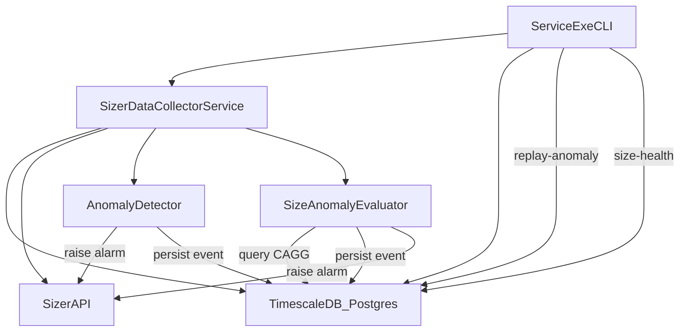
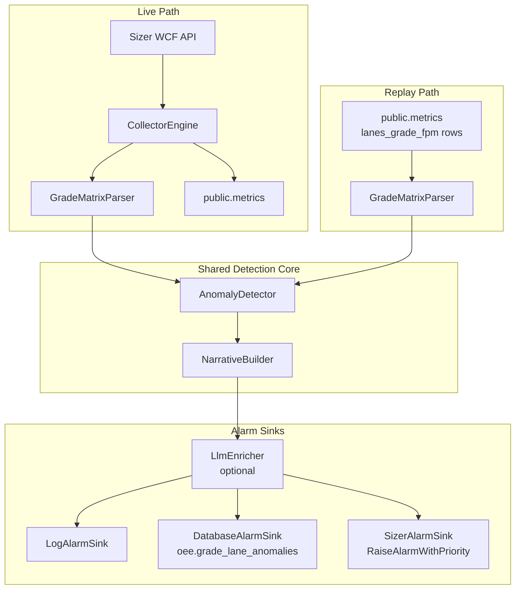
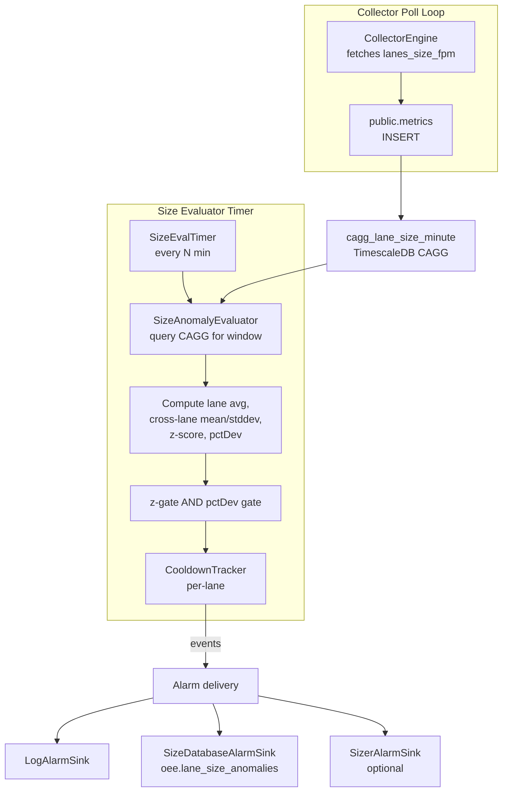

## AI Agent Guide for SizerDataCollector

### Purpose and scope

This guide is for **AI assistants and advanced developers** working on the OPTI-FRESH Sizer Data Collector in Cursor.  
It explains:

- Where the **sources of truth** live (C#, SQL, config).
- How the **CLI**, **Windows service**, and **database** interact.
- How to **safely extend** the system without reintroducing fragile, numbered migrations.

Use this file to decide **where** to make a change and **which commands** to run, before editing any code.

---

### High-level architecture

- **Executable / CLI**: `SizerDataCollector.Service.exe`
  - Hosts the Windows service `SizerDataCollectorService`.
  - Also exposes CLI subcommands for `service`, `db`, `machine`, and configuration.
- **Service process**: `SizerDataCollectorService`
  - Periodically polls the Sizer API, writes raw metrics to TimescaleDB, and drives the OEE pipeline.
  - Uses robust retry/backoff for Sizer API connectivity; it does **not** fail/idle on startup if the API is unreachable.
- **Database**: TimescaleDB/Postgres (e.g. `sizer_metrics_staging`)
  - Contains:
    - Base tables (`public.machines`, `public.batches`, `public.metrics`, etc.).
    - OEE tables (`oee.machine_thresholds`, `oee.band_definitions`, `oee.quality_params`, `oee.perf_params`, etc.).
    - Anomaly events tables (`oee.grade_lane_anomalies`, `oee.lane_size_anomalies`) -- persisted by alarm sinks.
    - Continuous aggregates (CAGGs) and views used by reporting and dashboards.

Mermaid overview:


```mermaid
flowchart TD
  cli[ServiceExeCLI] --> serviceProc[SizerDataCollectorService]
  cli --> db[TimescaleDB_Postgres]
  serviceProc --> db
  serviceProc --> sizerApi[SizerAPI]
  serviceProc --> anomaly[AnomalyDetector]
  anomaly -->|raise alarm| sizerApi
  anomaly -->|persist event| db
  serviceProc --> sizeEval[SizeAnomalyEvaluator]
  sizeEval -->|query CAGG| db
  sizeEval -->|persist event| db
  sizeEval -->|raise alarm| sizerApi
  cli -->|replay-anomaly| db
  cli -->|size-health| db
```

---

### Key C# entry points

- **CLI / service host**
  - `SizerDataCollector.Service/Program.cs`
    - Parses top-level commands: `service`, `db`, `machine`, `configure`, `set-*`, `console`, etc.
    - Contains implementations for service install/uninstall/start/stop/restart/status.
- **Database CLI commands**
  - `SizerDataCollector.Service/Commands/DbCommands.cs`
    - `db status`, `db init`, `db apply-functions`, `db apply-caggs`, `db apply-views`, `db apply-all`,
      `db list-functions`, `db list-views`, `db list-caggs` (optional `--include-legacy` on the two list commands).
- **Machine / OEE configuration CLI**
  - `SizerDataCollector.Service/Commands/MachineCommands.cs`
    - `machine list`, `register`, `status`, `set-thresholds`, `set-settings`, `grade-map`, `commission`,
      `show-quality-params`, `set-quality-params`, `show-perf-params`, `set-perf-params`,
      `show-bands`, `set-band`, `remove-band`.
- **Database helpers**
  - `SizerDataCollector.Core/Db/SqlDefinitionRunner.cs`
    - Resolves SQL definition files from either:
      - `<SharedDataDirectory>\sql\definitions\*`, or
      - `<exe>\sql\definitions\*` (built-in defaults),
    - Executes them over Npgsql; returns an `ApplyResult`.
  - `SizerDataCollector.Core/Db/OeeParamsRepository.cs`
    - Manages:
      - `oee.quality_params`
      - `oee.perf_params`
      - `oee.band_definitions`
    - Used by `MachineCommands` for OEE parameter and band configuration.

- **Anomaly detection**
  - `SizerDataCollector.Core/AnomalyDetection/`
    - 19 files covering: grade detector, size evaluator, configs, event models, alarm sinks, JSON parsing, replay, narrative generation.
    - See the [Anomaly detection subsystem](#anomaly-detection-subsystem) and [Size anomaly detection subsystem](#size-anomaly-detection-subsystem) sections for the full file tables.
  - Grade detector: wired into `CollectorEngine.RunSinglePollAsync` (inline, zero extra threads).
  - Size evaluator: runs on its own `Task.Delay`-based timer in `SizerCollectorService.RunSupervisedLoopAsync`.
  - CLI commands: `set-anomaly`, `set-sizer-alarm`, `replay-anomaly`, `set-size-anomaly`, `size-health` in `Program.cs`.

When deciding **where to add logic**, prefer:

- New CLI behavior ⇒ extend `Program.cs`, `DbCommands.cs`, or `MachineCommands.cs`.
- New DB-level behavior ⇒ extend the relevant SQL definition file (see below) and use existing CLI commands to apply changes.
- Anomaly detection logic ⇒ `SizerDataCollector.Core/AnomalyDetection/` (see below).

---

### Anomaly detection subsystem

The solution includes a **Pearson chi-squared residual anomaly detector** for lane-by-grade throughput data. It is ported from the original Python prototype in `zzz_Grade_Alarm/monitor/` but reimplemented entirely in C# within the DataCollector solution.

#### How it works

1. Every collector poll cycle, the `CollectorEngine` fetches `lanes_grade_fpm` from the Sizer WCF API and writes the raw JSON to `public.metrics`.
2. When `EnableAnomalyDetection` is `true`, the engine also parses that same in-memory JSON payload via `GradeMatrixParser` into a `GradeMatrix` (lanes x grades double array).
3. `AnomalyDetector.Update(matrix)` adds the snapshot to a rolling window (default 60 samples), computes an aggregate, then:
   - Calculates **expected counts** per cell via the independence model: `E[i,j] = row_sum[i] * col_sum[j] / total`.
   - Computes **z-scores**: `z = (Observed - Expected) / sqrt(Expected)`.
   - Computes **percent deviation**: `pct = 100 * (Observed - Expected) / Expected`.
   - Evaluates alarm rules: `|z| >= z_gate` AND `|pct|` in a severity band (Low/Medium/High).
   - Applies per-(lane, grade) cooldown to prevent alarm flooding.
   - Generates human-readable narrative text (special Recycle handling, upgrading/downgrading).
4. Any detected anomaly events are delivered through the `IAlarmSink` chain:
   - `LogAlarmSink` -- writes to the collector log.
   - `DatabaseAlarmSink` -- INSERTs into `oee.grade_lane_anomalies`.
   - `SizerAlarmSink` -- calls `RaiseAlarmWithPriority` on the Sizer WCF API to show on the operator alarm screen.
   - `LlmEnricher` (optional) -- decorates the event with an LLM-generated operator-friendly explanation before forwarding.

The detector runs **inline** in the collector poll loop -- zero additional threads, API calls, or DB reads for live operation. If the collector is down, the detector is appropriately idle.

#### Batch-change reset

When the `CollectorEngine` detects that `batch_record_id` has changed between poll cycles, it calls `AnomalyDetector.Reset()` to clear the rolling window. This prevents cross-batch statistical contamination.

#### Key files

| File | Purpose |
|------|---------|
| `SizerDataCollector.Core/AnomalyDetection/AnomalyDetector.cs` | Core z-score engine (rolling window, expected/z/pct, alarm evaluation) |
| `SizerDataCollector.Core/AnomalyDetection/AnomalyDetectorConfig.cs` | Settings POCO built from `CollectorConfig` |
| `SizerDataCollector.Core/AnomalyDetection/AnomalyEvent.cs` | Event model matching `oee.grade_lane_anomalies` schema |
| `SizerDataCollector.Core/AnomalyDetection/GradeMatrix.cs` | Immutable lanes x grades double array with grade key labels |
| `SizerDataCollector.Core/AnomalyDetection/GradeMatrixParser.cs` | Parses raw `lanes_grade_fpm` JSON into `GradeMatrix` (shared by live + replay) |
| `SizerDataCollector.Core/AnomalyDetection/NarrativeBuilder.cs` | Alarm text generation (Recycle special case, upgrading/downgrading) |
| `SizerDataCollector.Core/AnomalyDetection/PriorityClassifier.cs` | Band classification (None/Low/Medium/High) and WCF `AlarmPriority` mapping |
| `SizerDataCollector.Core/AnomalyDetection/CooldownTracker.cs` | Per-(lane, gradeKey) cooldown tracker |
| `SizerDataCollector.Core/AnomalyDetection/IAlarmSink.cs` | Alarm delivery interface |
| `SizerDataCollector.Core/AnomalyDetection/SizerAlarmSink.cs` | Delivers alarms to Sizer via WCF `RaiseAlarmWithPriority` |
| `SizerDataCollector.Core/AnomalyDetection/DatabaseAlarmSink.cs` | Persists events to `oee.grade_lane_anomalies` |
| `SizerDataCollector.Core/AnomalyDetection/LogAlarmSink.cs` | Structured logging via existing `Logger` |
| `SizerDataCollector.Core/AnomalyDetection/CompositeAlarmSink.cs` | Fans out delivery to all enabled sinks |
| `SizerDataCollector.Core/AnomalyDetection/LlmEnricher.cs` | Optional LLM decorator for `IAlarmSink` |
| `SizerDataCollector.Core/AnomalyDetection/ReplayDataSource.cs` | Reads raw JSON from `public.metrics` for offline replay |

#### Configuration properties (in `collector_config.json`)

| Property | Default | Description |
|----------|---------|-------------|
| `EnableAnomalyDetection` | `false` | Master toggle for the anomaly detector |
| `AnomalyWindowMinutes` | `60` | Rolling window size (number of samples) |
| `AnomalyZGate` | `2.0` | Minimum |z-score| required to trigger an alarm |
| `BandLowMin` | `5.0` | Minimum |pct deviation| for any alarm |
| `BandLowMax` | `10.0` | Upper bound for Low severity (below this = Low) |
| `BandMediumMax` | `20.0` | Upper bound for Medium severity (below this = Medium, above = High) |
| `AlarmCooldownSeconds` | `300` | Seconds before the same (lane, grade) pair can alarm again |
| `RecycleGradeKey` | `"RCY"` | Grade key receiving special narrative treatment |
| `EnableSizerAlarm` | `true` | Send anomaly alarms to Sizer operator screen (can be toggled independently of detection) |
| `EnableLlmEnrichment` | `false` | Enable LLM-generated operator explanations |
| `LlmEndpoint` | `""` | URL of the LLM API for enrichment |

#### Data flow diagram


```mermaid
flowchart TD
    subgraph livePath [Live Path]
        SIZER["Sizer WCF API"]
        ENGINE["CollectorEngine"]
        PARSER["GradeMatrixParser"]
        DB_WRITE["public.metrics"]
    end

    subgraph replayPath [Replay Path]
        DB_READ["public.metrics\nlanes_grade_fpm rows"]
        REPLAY_PARSER["GradeMatrixParser"]
    end

    subgraph detector [Shared Detection Core]
        DET["AnomalyDetector"]
        NARR["NarrativeBuilder"]
    end

    subgraph sinks [Alarm Sinks]
        LOG_SINK["LogAlarmSink"]
        DB_SINK["DatabaseAlarmSink\noee.grade_lane_anomalies"]
        SIZER_SINK["SizerAlarmSink\nRaiseAlarmWithPriority"]
        LLM_SINK["LlmEnricher\noptional"]
    end

    SIZER --> ENGINE
    ENGINE --> PARSER
    ENGINE --> DB_WRITE
    PARSER --> DET

    DB_READ --> REPLAY_PARSER
    REPLAY_PARSER --> DET

    DET --> NARR
    NARR --> LLM_SINK
    LLM_SINK --> LOG_SINK
    LLM_SINK --> DB_SINK
    LLM_SINK --> SIZER_SINK
```

### Size anomaly detection subsystem

The solution includes a **periodic lane-size anomaly evaluator** that detects when a lane's average fruit size deviates significantly from the cross-lane mean. Unlike the inline grade detector, this evaluator is DB-driven and runs on its own timer.

#### How it works

1. The collector already writes `lanes_size_fpm` JSON to `public.metrics` every poll cycle.
2. TimescaleDB materializes `cagg_lane_size_minute` -- per `(minute, serial_no, lane)` weighted-average fruit size (never mixed across sizers).
3. When `EnableSizeAnomalyDetection` is `true`, a background timer fires every `SizeEvalIntervalMinutes` (default 30) and runs the `SizeAnomalyEvaluator`:
   - Queries the CAGG for the last `SizeWindowHours` (default 24h), computing each lane's fruit-count-weighted average size.
   - Computes the cross-lane mean and population stddev.
   - For each lane: `z = (lane_avg - machine_avg) / stddev` and `pctDev = 100 * (lane_avg - machine_avg) / machine_avg`.
   - An alarm fires when **both** `|z| >= SizeZGate` AND `|pctDev| >= SizePctDevMin`.
   - Severity: Low (< 5% deviation), Medium (5-10%), High (>= 10%).
   - Per-lane cooldown of `SizeCooldownMinutes` (default 240 = 4 hours) prevents alarm flooding.
4. Alarms are delivered to:
   - `LogAlarmSink` -- always.
   - `SizeDatabaseAlarmSink` -- INSERTs into `oee.lane_size_anomalies`.
   - `SizerAlarmSink` -- only when `EnableSizerSizeAlarm` is `true` (off by default).

#### Narrative format

```
Lane 3: sorting 4.6% larger fruit than average (27.2mm vs 26.0mm avg, +1.2mm, +4.6%, z=+3.0, last 24h)
Lane 7: sorting 3.1% smaller fruit than average (25.2mm vs 26.0mm avg, -0.8mm, -3.1%, z=-2.1, last 24h)
```

#### Key differences from grade anomaly detection

| Aspect | Grade detector | Size detector |
|--------|---------------|---------------|
| Trigger | Per-minute, inline in poll loop | Periodic timer, DB-driven |
| Data source | In-memory raw JSON from WCF API | `cagg_lane_size_minute` CAGG |
| Window | 60 samples (rolling) | 24 hours (configurable) |
| Metric | Grade proportions per lane vs cross-lane mean | Weighted-average fruit size per lane vs cross-lane mean |
| Default cooldown | 5 minutes | 4 hours |
| Sizer alarm | On by default | Off by default |

#### Key files

| File | Purpose |
|------|---------|
| `SizerDataCollector.Core/AnomalyDetection/SizeAnomalyEvaluator.cs` | Core evaluator: queries CAGG, computes cross-lane stats, gates alarms, generates narrative |
| `SizerDataCollector.Core/AnomalyDetection/SizeAnomalyConfig.cs` | Configuration POCO extracted from `CollectorConfig` |
| `SizerDataCollector.Core/AnomalyDetection/SizeAnomalyEvent.cs` | Event model matching `oee.lane_size_anomalies` schema |
| `SizerDataCollector.Core/AnomalyDetection/SizeDatabaseAlarmSink.cs` | Persists size anomaly events to `oee.lane_size_anomalies` |

#### Size anomaly configuration properties (in `collector_config.json`)

| Property | Default | Description |
|----------|---------|-------------|
| `EnableSizeAnomalyDetection` | `false` | Master toggle for the size anomaly evaluator |
| `EnableSizerSizeAlarm` | `false` | Send size alarms to Sizer operator screen |
| `SizeEvalIntervalMinutes` | `30` | How often the evaluator runs |
| `SizeWindowHours` | `24` | Lookback window in hours |
| `SizeZGate` | `2.0` | Minimum \|z-score\| to trigger an alarm |
| `SizePctDevMin` | `3.0` | Minimum \|percent deviation\| to trigger an alarm |
| `SizeCooldownMinutes` | `240` | Per-lane cooldown (4 hours) |

#### Size anomaly data flow


```mermaid
flowchart TD
    subgraph collector [Collector Poll Loop]
        POLL["CollectorEngine\nfetches lanes_size_fpm"] --> DB_WRITE["public.metrics\nINSERT"]
    end
    DB_WRITE --> CAGG["cagg_lane_size_minute\nTimescaleDB CAGG"]
    subgraph sizeEval [Size Evaluator Timer]
        TIMER["SizeEvalTimer\nevery N min"] --> QUERY["SizeAnomalyEvaluator\nquery CAGG for window"]
        QUERY --> STATS["Compute lane avg,\ncross-lane mean/stddev,\nz-score, pctDev"]
        STATS --> GATE["z-gate AND pctDev gate"]
        GATE --> COOLDOWN["CooldownTracker\nper-lane"]
    end
    CAGG --> QUERY
    COOLDOWN -->|events| SINK_CHAIN["Alarm delivery"]
    SINK_CHAIN --> LOG_SINK["LogAlarmSink"]
    SINK_CHAIN --> DB_SINK["SizeDatabaseAlarmSink\noee.lane_size_anomalies"]
    SINK_CHAIN --> SIZER_SINK["SizerAlarmSink\noptional"]
```

#### Database objects

- **`public.cagg_lane_size_minute`** -- TimescaleDB continuous aggregate. Defined in `continuous_aggregates.sql`. One row per `(minute_ts, serial_no, lane_idx)`: weighted-average fruit size from `lanes_size_fpm` for that sizer only. Filters out null JSON array elements. `SizeAnomalyEvaluator` always filters `WHERE serial_no = @serial_no`. If you deployed an older CAGG without `serial_no`, drop it and re-apply (see comment in `continuous_aggregates.sql`), then refresh the aggregate.
- **`public.lane_size_anomaly`**, **`public.lane_size_health_24h`**, **`public.lane_size_health_season`** -- Defined in `views.sql`. All partition cross-lane stats by `serial_no`. Dashboard SQL should filter `WHERE serial_no = '<sn>'` (replacing any hard-coded serial).
- **`oee.lane_size_anomalies`** -- Event table. Defined in `schema.sql`. Stores `event_ts`, `serial_no`, `lane_no`, `window_hours`, `lane_avg_size`, `machine_avg_size`, `pct_deviation`, `z_score`, `severity`, `model_version`, `delivered_to`.

---

### Canonical SQL definition files (single source of truth)

All schema-level database changes should be made in **four authoritative files** under the service project:

- `SizerDataCollector.Service/sql/definitions/schema.sql`
  - Schemas, tables, sequences, indexes, constraints, hypertables.
  - Designed to be **idempotent** using `IF NOT EXISTS` and compatible with existing databases.
  - Run via `db init` (which calls `ApplyFile("schema.sql")` followed by the other definitions).

- `SizerDataCollector.Service/sql/definitions/functions.sql`
  - All PostgreSQL **functions**, including:
    - Core OEE helpers (`oee.availability_ratio`, `oee.calc_perf_ratio`, `oee.calc_quality_ratio_qv1`, etc.).
    - Serial-aware overloads that read `oee.perf_params` and `oee.quality_params`.
    - Production-only helpers such as `oee.get_lane_count`, `oee.grade_qty`, `oee.ingest_lane_grade_events`, `oee.refresh_lane_grade_minute`.
  - All definitions use `CREATE OR REPLACE FUNCTION` and are safe to reapply.

- `SizerDataCollector.Service/sql/definitions/continuous_aggregates.sql`
  - All **TimescaleDB continuous aggregate** views and refresh policies:
    - Availability/throughput/grade CAGGs.
    - Refresh policies and any custom jobs.
  - CAGGs are created inside `DO $$` blocks with `IF NOT EXISTS` checks against `timescaledb_information.continuous_aggregates`.
  - Refresh policies use `if_not_exists => true` to avoid duplication.
  - **Legacy (intentionally absent):** `public.cagg_lane_grade_minute` is **not** defined here. Older databases may still have it; it reads `lanes_grade_fpm` directly and refresh can fail on bad JSON. The supported path is `oee.lane_grade_minute` (via the `oee.refresh_lane_grade_minute` job) and the `oee.cagg_lane_grade_qty_*` / `oee.cagg_grade_qty_*` CAGGs. **`db list-caggs`** and **`db list-views`** omit that legacy CAGG and `public.v_quality_minute_filled` unless **`--include-legacy`**. Do not add `CALL refresh_continuous_aggregate('public.cagg_lane_grade_minute', …)` to normal runbooks.

- `SizerDataCollector.Service/sql/definitions/views.sql`
  - All user-facing **views**, including the higher-level OEE rollups and reporting views that match production.
  - Uses `CREATE OR REPLACE VIEW` and is safe to reapply.

**Rules for agents:**

- Do **not** reintroduce numbered migrations under `db\Migrations\Vxxx_*`.
- To change the schema, **edit these four files** and run the appropriate `db` CLI commands.
- Keep the four files **consistent** with each other (e.g. if a function relies on a new table, ensure the table exists in `schema.sql`).
- Avoid editing TimescaleDB internal objects (schemas beginning with `_timescaledb_internal`).

---

### CLI command reference (for automation)

All commands are executed against `SizerDataCollector.Service.exe` from the service output folder.

#### Configuration and diagnostics

- Show current runtime config:
  - `SizerDataCollector.Service.exe show-config`
- Interactive configuration:
  - `SizerDataCollector.Service.exe configure`
- Set Sizer API endpoint and timeouts:
  - `SizerDataCollector.Service.exe set-sizer --host <host> --port <port> [--open-timeout <sec>] [--send-timeout <sec>] [--receive-timeout <sec>]`
- Set DB connection string:
  - `SizerDataCollector.Service.exe set-db --connection "Host=...;Port=5432;Username=...;Password=...;Database=sizer_metrics_staging;"`
- Enable/disable ingestion via config:
  - `SizerDataCollector.Service.exe set-ingestion --enabled true|false`
- Configure shared data directory (for overriding built-in SQL):
  - `SizerDataCollector.Service.exe set-shared-dir --path "C:\ProgramData\Opti-Fresh\SizerCollector"`
- Probe Sizer API + Timescale connectivity:
  - `SizerDataCollector.Service.exe test-connections`

#### Service lifecycle

- Install service (Admin):
  - `SizerDataCollector.Service.exe service install`
- Uninstall service (Admin):
  - `SizerDataCollector.Service.exe service uninstall`
- Start/stop/restart (Admin):
  - `SizerDataCollector.Service.exe service start [--timeout <seconds>]`
  - `SizerDataCollector.Service.exe service stop  [--timeout <seconds>]`
  - `SizerDataCollector.Service.exe service restart [--timeout <seconds>]`
- Check service status:
  - `SizerDataCollector.Service.exe service status`

#### Database management

- Health/status:
  - `SizerDataCollector.Service.exe db status`
- One-shot, from-scratch or incremental setup:
  - `SizerDataCollector.Service.exe db init`
    - Applies `schema.sql` then all other definition files.
- Targeted re-application:
  - `SizerDataCollector.Service.exe db apply-functions`
  - `SizerDataCollector.Service.exe db apply-caggs`
  - `SizerDataCollector.Service.exe db apply-views`
  - `SizerDataCollector.Service.exe db apply-all`
- Introspection (read-only):
  - `SizerDataCollector.Service.exe db list-functions`
  - `SizerDataCollector.Service.exe db list-views`  
    Append `--include-legacy` to list retired `public.cagg_lane_grade_minute` and `public.v_quality_minute_filled` when they still exist.
  - `SizerDataCollector.Service.exe db list-caggs`  
    Append `--include-legacy` to list retired `public.cagg_lane_grade_minute` when it still exists.

#### Machine / OEE configuration

- Discovery and basic settings:
  - `SizerDataCollector.Service.exe machine list`
  - `SizerDataCollector.Service.exe machine register --serial <sn> --name <name>`
  - `SizerDataCollector.Service.exe machine status --serial <sn>`
  - `SizerDataCollector.Service.exe machine set-thresholds --serial <sn> --min-rpm <val> --min-total-fpm <val>`
  - `SizerDataCollector.Service.exe machine set-settings --serial <sn> --target-speed <val> --lane-count <val> --target-pct <val> --recycle-outlet <val>`

- Grade overrides:
  - List overrides:
    - `SizerDataCollector.Service.exe machine grade-map --serial <sn>`
  - Set/override grade:
    - `SizerDataCollector.Service.exe machine grade-map --serial <sn> --set --grade <key> --category <0-3>`

- Commissioning (non-gating check):
  - `SizerDataCollector.Service.exe machine commission --serial <sn>`
    - Uses `CommissioningService` to summarize readiness: DB bootstrapped, Sizer connectivity, discovery, thresholds, grade mapping.

- Quality parameters:
  - Show:
    - `SizerDataCollector.Service.exe machine show-quality-params --serial <sn>`
  - Upsert (any subset of fields; others default or retain existing values):
    - `SizerDataCollector.Service.exe machine set-quality-params --serial <sn> [--tgt-good <v>] [--tgt-peddler <v>] [--tgt-bad <v>] [--tgt-recycle <v>] [--w-good <v>] [--w-peddler <v>] [--w-bad <v>] [--w-recycle <v>] [--sig-k <v>]`

- Performance parameters:
  - Show:
    - `SizerDataCollector.Service.exe machine show-perf-params --serial <sn>`
  - Upsert:
    - `SizerDataCollector.Service.exe machine set-perf-params --serial <sn> [--min-effective <v>] [--low-ratio <v>] [--cap-asymptote <v>]`

- OEE bands:
  - Show bands:
    - `SizerDataCollector.Service.exe machine show-bands --serial <sn>`
  - Upsert a band:
    - `SizerDataCollector.Service.exe machine set-band --serial <sn> --band <name> --lower <val> --upper <val>`
  - Deactivate a band:
    - `SizerDataCollector.Service.exe machine remove-band --serial <sn> --band <name>`

#### Grade anomaly detection

- Enable/disable grade anomaly detection:
  - `SizerDataCollector.Service.exe set-anomaly --enabled true|false`
  - Can also configure individual parameters:
    - `--window <minutes>` -- rolling window size.
    - `--z-gate <value>` -- z-score threshold (e.g. `2.0`).
    - `--band-low-min <pct>` -- minimum percent deviation to alarm.
    - `--band-low-max <pct>` -- Low/Medium boundary.
    - `--band-medium-max <pct>` -- Medium/High boundary.
    - `--cooldown <seconds>` -- per-(lane, grade) alarm cooldown.
    - `--recycle-key <name>` -- grade key treated as Recycle.
    - `--llm true|false` -- enable LLM enrichment.
    - `--llm-endpoint <url>` -- LLM API endpoint.
- Enable/disable Sizer alarm screen delivery (independent of detection):
  - `SizerDataCollector.Service.exe set-sizer-alarm --enabled true|false`
  - When `false`, anomaly detection still runs and logs/persists to DB, but does not send alarms to the Sizer operator screen.
- Replay grade anomaly detection against historical data:
  - `SizerDataCollector.Service.exe replay-anomaly --serial <sn> --from <datetime> --to <datetime> [--persist]`
    - Reads raw `lanes_grade_fpm` JSON payloads from `public.metrics` for the given serial number and time range.
    - Feeds them through the same `AnomalyDetector` + `GradeMatrixParser` pipeline used in live mode.
    - Outputs detected anomaly events to the console (and to log).
    - With `--persist`, also writes events to the `IAlarmSink` chain (DB + Sizer alarm + LLM if enabled).

#### Size anomaly detection

- Enable/disable size anomaly detection:
  - `SizerDataCollector.Service.exe set-size-anomaly --enabled true|false`
  - Can also configure individual parameters:
    - `--interval <minutes>` -- evaluation interval.
    - `--window <hours>` -- lookback window in hours.
    - `--z-gate <value>` -- z-score threshold (e.g. `2.0`).
    - `--pct-dev-min <value>` -- minimum percent deviation to alarm (e.g. `3.0`).
    - `--cooldown <minutes>` -- per-lane cooldown in minutes.
    - `--sizer-alarm true|false` -- enable/disable Sizer screen delivery for size alarms.
- Query lane size health (doubles as testing/replay tool):
  - `SizerDataCollector.Service.exe size-health --serial <sn> [--hours <h>]`
  - `SizerDataCollector.Service.exe size-health --serial <sn> --from <date> --to <date>`
  - Displays a table showing each lane's average size, deviation from machine average, percent deviation, z-score, and alarm status.
  - Example output:
    ```
    Lane size health for 140578 (1 days, machine avg = 25.1mm)

    Lane | Avg Size | vs Machine |  pctDev  |  z-score | Status
    -----|----------|------------|----------|----------|--------
       1 |   25.1mm |     +0.0mm |    +0.0% |     +1.2 |
       8 |   25.6mm |     +0.5mm |    +3.5% |     +2.8 | ALARM (oversizing)
    ```

#### Alarm testing

- Send a test alarm to the Sizer screen to verify WCF connectivity:
  - `SizerDataCollector.Service.exe test-alarm`
  - `SizerDataCollector.Service.exe test-alarm --type grade|size|both --severity low|medium|high`
  - Defaults: `--type both --severity low`. Sends one alarm per type. Reports success/failure per alarm.
  - Useful for confirming the Sizer API endpoint is reachable and alarms appear on the operator screen.

---

### Configuration and environment rules

- **`SizerDataCollector.Service/app.config`**
  - Treat as the primary place for service-level configuration such as:
    - `TimescaleDb` connection string.
    - `LogDirectory`.
  - Do **not** bake secrets or environment-specific paths directly into code; prefer config.

- **`collector_config.json` (runtime settings)**
  - Managed via `CollectorSettingsProvider` (in Core).
  - The CLI (`set-sizer`, `set-db`, `set-ingestion`, `set-shared-dir`, `configure`) should be the **only** way agents adjust these values.
  - Do not hand-edit this file unless absolutely necessary; use CLI commands instead.

- **Shared data directory**
  - When `SharedDataDirectory` is set, `SqlDefinitionRunner` first checks:
    - `<SharedDataDirectory>\sql\definitions\schema.sql`
    - `<SharedDataDirectory>\sql\definitions\functions.sql`
    - `<SharedDataDirectory>\sql\definitions\continuous_aggregates.sql`
    - `<SharedDataDirectory>\sql\definitions\views.sql`
  - If a file exists there, it **overrides** the embedded copy next to the executable.
  - This is the preferred way to deploy updated SQL to production without rebuilding.

- **Environment variable overrides**
  - `FORCE_ENABLE_INGESTION=1`:
    - Forces ingestion on, even if configuration would disable it.
    - Use sparingly; prefer `set-ingestion --enabled true` when possible.

---

### Safe-change checklist for agents

Before making any change:

1. **Identify the correct layer**
   - CLI / workflow change? ⇒ `Program.cs`, `DbCommands.cs`, `MachineCommands.cs`.
   - DB schema / functions / views / CAGGs change? ⇒ one of the four SQL definition files.
   - OEE per-machine parameter behavior? ⇒ `OeeParamsRepository.cs` and corresponding SQL tables.
   - Anomaly detection logic? ⇒ `SizerDataCollector.Core/AnomalyDetection/`. Do **not** scatter detector code across the solution; keep it in this namespace.
   - Anomaly alarm delivery? ⇒ Implement a new `IAlarmSink` and register it in `SizerCollectorService.RunSupervisedLoopAsync`.

2. **Edit the canonical file**
   - Tables/indexes ⇒ `schema.sql`.
   - Functions ⇒ `functions.sql`.
   - Continuous aggregates / policies / jobs ⇒ `continuous_aggregates.sql`.
   - Views ⇒ `views.sql`.

3. **Keep definitions idempotent**
   - Use `CREATE OR REPLACE` for functions and views.
   - Use `IF NOT EXISTS` patterns for tables, sequences, CAGGs, and policies.
   - Avoid dropping or renaming columns in a way that would break existing data without explicit user instruction.

4. **Test in a non-production database**
   - Apply changes to a staging database using:
     - `db init` (for broad changes), or
     - `db apply-functions` / `db apply-caggs` / `db apply-views` (for narrower changes).
   - Confirm `db status` reports a healthy system.

5. **Update documentation when surfaces change**
   - If you add or change CLI commands or options, update:
     - `SizerDataCollector.Service/Program.cs` `ShowUsage()` output.
     - `README.md` CLI usage summary.
     - This `AI_AGENT_GUIDE.md` if the change impacts how agents should operate.

By following this guide, AI assistants can safely modify the system, apply database updates, and reason about configuration without reintroducing legacy migration complexity.

