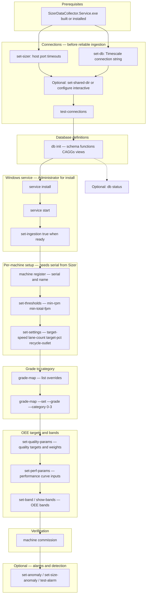

# SizerDataCollector OEE setup flow

This document summarizes the **recommended order** for bringing the collector online and configuring OEE-related settings. Commands target **`SizerDataCollector.Service.exe`** (project **SizerDataCollector.Service**); the Windows service registers as **`SizerDataCollectorService`**.

Configuration is written to **`%ProgramData%\Opti-Fresh\SizerDataCollector\collector_config.json`** via the CLI (see `README.md` and `AI_AGENT_GUIDE.md` for full command reference).

---

## Setup diagram



---

## Notes

- **Service install/start** assumes **`db init`** has been run so Timescale has the expected schema; the service can start with API/DB temporarily down, but OEE data paths need the DB objects in place.
- **`machine register`** requires a **serial number** that matches the Sizer (often obtained after API connectivity; commissioning helps confirm discovery).
- **Grade categories** `0–3` map Sizer grades into OEE quality groupings; use **`machine grade-map`** to list and override.
- **Quality / performance / bands** are per serial: **`machine show-quality-params`**, **`show-perf-params`**, **`show-bands`** to inspect before changing.
- For **elevated** steps (`service install`, `uninstall`, `start`, `stop`, `restart`), run the CLI from an **Administrator** shell (or equivalent).

## Performance parameter defaults and tuning

Performance curve inputs are stored per machine serial in `oee.perf_params`:

- `min_effective_fpm` (default: `3`)
- `low_ratio_threshold` (default: `0.5`)
- `cap_asymptote` (default: `0.2`)

If no row exists for a serial in `oee.perf_params`, OEE throughput logic falls back to these defaults.

### Meaning

- `min_effective_fpm`: floor gate. If effective flow (`total_fpm - missed_fpm - recycle_fpm`) is below this value, performance ratio is `0`.
- `low_ratio_threshold`: low-band breakpoint in the piecewise curve.
- `cap_asymptote`: controls how fast performance saturates toward `1.0` when raw throughput exceeds target.

### Practical baseline guidance

- Start with defaults unless there is a measured issue: `3 / 0.5 / 0.2`.
- Tune one parameter at a time, then compare the same date range before/after.
- `min_effective_fpm`: increase if very low-flow noise is overstating performance; decrease if legitimate low-flow periods are being zeroed too aggressively.
- `cap_asymptote`: decrease to make above-target performance rise faster toward `1.0`; increase to make it rise more gradually.
- `low_ratio_threshold`: keep at `0.5` unless you intentionally validate a different curve shape in your environment.

### CLI

```powershell
SizerDataCollector.Service.exe machine show-perf-params --serial <sn>
SizerDataCollector.Service.exe machine set-perf-params --serial <sn> --min-effective <v> --low-ratio <v> --cap-asymptote <v>
```

For exact flags and examples, see **`README.md`** (Quickstart and CLI summary) and **`AI_AGENT_GUIDE.md`** (CLI command reference for automation).
